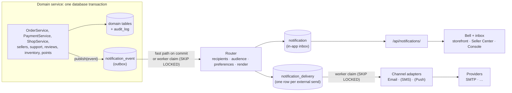

# MiniShop — Notification System Plan

**Created:** 2026-09-29 · **Baseline commit:** `6d08ef0` · **Status:** 📝 Plan. Confirm the
decisions in §3 before starting Task 1.

This is the architecture and task list for the notification system. Work through the
tasks in §14 **one at a time, in order**. Each task is one commit. When a task is done,
tick its boxes, set its **Status** line, and update the table at the top of §14.

To continue, just ask: **"do Task N"**.

> **Roadmap note.** `docs/FUTURE_PLAN.md` (2026-09-18) lists notifications under "Not in
> this roadmap". The owner asked for this system on 2026-09-29, so this plan is an
> exception to that list. Task 16 records the change in the roadmap and review docs.

---

## 1. What we are building

One platform service that tells the right person, through the right channel, when
something they care about has happened. The code that makes the thing happen doesn't
know who gets told, or how.

1. **Customers** hear about their orders, payments, refunds and support replies.
2. **Sellers** hear about new orders; decisions on their account, shops and products;
   low stock; new reviews; and points adjustments.
3. **Staff** hear about work waiting for them: shops to review, new support tickets, and
   tickets assigned to them.
4. Every notification lands in an **in-app inbox**. A bell with an unread count sits in
   the storefront header, the Seller Center and the Management Console. Selected
   notifications also go out by **email**. The design has room for **SMS** and **push**,
   but this plan doesn't build them.
5. People choose which categories reach them by email. A few categories can't be
   switched off.
6. Operators can see the backlog, failures and dead letters, and can retry them.

### Non-negotiables

| Property | What it means in MiniShop |
|---|---|
| **Decoupled** | A domain service publishes a *fact* ("order X moved from PENDING to SHIPPED"). It never picks recipients, channels or wording, and never calls a provider. Adding a channel or a recipient never touches order code. |
| **Reliable** | A notification is never lost once the business change commits, and never created if it rolls back. Crashes, provider outages and deploys only delay delivery. Every hop is idempotent. |
| **Scalable** | Workers scale out today on MySQL alone. The same interfaces can move to a message broker later without changing any producer. |
| **Observable** | Every event and every delivery has a status, an attempt count and its last error. The age of the backlog can be measured. |
| **Secure** | Recipients come from server-side data and RBAC, never from client input. A person can only ever read their own inbox. |

---

## 2. What already exists (verified 2026-09-29)

Read from the source on this date. The source and its tests are authoritative.

| Area | Finding | Consequence for this plan |
|---|---|---|
| Notifications | No notification code exists anywhere. The Master Prompt lists it as missing (`task/Master_Prompt.md` §28 item 7); so does `report.md` (line 547). | Greenfield: a new `notifications` app. |
| Support tickets | Has in-app unread markers only: `GET /api/support/tickets/unread-count/` and the seller variant (`support/views.py:191`, `:297`). The frontend re-counts on navigation and on `SUPPORT_UNREAD_EVENT` (`frontend/src/lib/support.ts:276`). | Keep them. Notifications add the bell, email and staff alerts on top (D10). |
| Domain services | State changes live in services decorated with `@transaction.atomic`: `sellers/services.py:75–95`, `ShopService` (`shops/services.py:363–436`), `OrderService` (`shop/services.py:399`, `:633`, `:700`, `:817`), `PaymentService` (`shop/payment_service.py:120`, `:196`, `:244`), `SupportTicketService` (`support/services.py:209`, `:301`, `:368`, `:519`), `ReviewService` / `ShopReviewService` (`customers/services.py:341`, `:449`), `InventoryService` (`shop/inventory_service.py:60`, `:153`), `PointService.adjust_points` (`points/services.py:204`). | These are the publish points. An event row written inside their transaction commits or rolls back with the change. |
| Audit precedent | `AuditService.log` (`audit/services.py:17`) writes in the caller's transaction. `audit` is kept a leaf app so any app can import it without a cycle (`audit/admin_mixins.py` docstring). | The publisher follows the same pattern and the same leaf rule. |
| **Transition bypass 1** | The console's `AdminShopStatusAPIView` (`shop/admin_views.py:1080`) sets `shop.status` inline instead of calling `ShopService`. The two disagree on rules: `ShopService.approve_shop` only accepts PENDING or DRAFT (`shops/services.py:384`); the view approves from any status. | Task 1 moves it onto `ShopService`. Otherwise one business fact would need two publish calls. |
| **Transition bypass 2** | Product moderation (approve, reject, publish, unpublish) exists only inline in `AdminProductStatusAPIView` (`shop/admin_views.py:1212`). `ProductService` has no moderation method. | Task 2 extracts it into `ProductService`. |
| Product submission | Products are created as DRAFT (`shop/services.py:138`), and no code path sets SUBMITTED. | There is no "product submitted" producer, so that event is not in v1. |
| RBAC | `has_user_permission` (`rbac/services.py:67`) = role grants + direct user grants + the `*` wildcard + `is_superuser`. There's no reverse lookup ("who holds code X?"). | Task 5 adds `users_with_permission()` next to it, mirroring the same rules. |
| Infrastructure | MySQL **8.0.46**, isolation READ-COMMITTED, so `SELECT … FOR UPDATE SKIP LOCKED` is available. No Redis, Celery, Channels or ASGI. `CACHES` is LocMem, `LOGGING` isn't configured, and `EMAIL_BACKEND` is Django's SMTP default with no host set, so any send today would fail. | The v1 queue runs on MySQL (D2). Email needs settings (Task 7). |
| Scheduling precedent | `support/management/commands/close_resolved_tickets.py`, run from cron or Windows Task Scheduler (`docs/SUPPORT_SYSTEM.md` Task 11). | The worker is a management command run the same way. |
| Contact data | `User.email`, `CustomerProfile.phone` (`customers/models.py:31`), `SellerProfile.business_email` / `business_phone` (`sellers/models.py:54–55`). | Email addresses exist for every audience. Phone numbers exist for a future SMS channel. |
| Frontend | Headers: `components/layout/Header.tsx` (storefront), `components/seller/SellerHeader.tsx`, `components/admin/AdminHeader.tsx`. Unread-count pattern: `profile/layout.tsx`, `SellerSidebar.tsx`. Time formatting: `formatRelativeTime` in `lib/support.ts`. | The bells go into the three headers and reuse the unread pattern. |

---

## 3. Decisions

**Status: proposed, awaiting the owner's confirmation.** Each row is the recommended
answer. Changing one changes the tasks marked beside it.

| # | Question | Proposed answer | Why | Affects |
|---|---|---|---|---|
| D1 | Which channels in v1? | **In-app for every event, plus email for a defined subset** (§5). SMS and push get a channel-adapter interface only. | In-app needs no provider. Email covers the moments that matter when someone isn't in the app. SMS costs money per message and needs a Bangladeshi provider. | 7, 8–10 |
| D2 | What infrastructure? | **None new.** A MySQL *transactional outbox* plus worker processes (a management command) that claim rows with `SKIP LOCKED`. A broker (Redis or RabbitMQ with Celery) is Stage 2 (§4.6), behind the same interfaces. | No production deployment is planned (FUTURE_PLAN decision 3). One database is one less thing to run. MiniShop's volume is far below what MySQL handles. | 3–6 |
| D3 | How fresh is the in-app inbox? | Routing runs **right after commit** in the same process (fast path), and the worker sweeps up anything missed. The bell **polls the unread count every 60 s while the tab is visible**, and re-counts on navigation and after a read. No WebSockets or SSE in v1. | Seconds-level freshness without new infrastructure. Real-time push is Stage 3. | 4, 12 |
| D4 | What delivery guarantee? | **At-least-once, deduplicated at every hop** by unique keys. External channels can very rarely send twice if a worker crashes between the send and recording it. That's documented, not hidden. | Exactly-once across an SMTP boundary is impossible. Idempotent hops make duplicates invisible everywhere else. | 4–7 |
| D5 | Who counts as "staff" for an alert? | Users who hold the permission code through a **role or a direct grant**, resolved when the event is routed, so revoked staff stop receiving alerts. **Superusers are not included by `is_superuser` alone.** | Superusers would otherwise receive every staff alert on the platform. | 5 |
| D6 | Where are events published? | **Only in domain services**: one publish point per business fact. The two bypasses (§2) are consolidated first (Tasks 1–2). Editing a status field directly in the Django admin (for example the product form's status dropdown) doesn't notify. | Publishing from views duplicates logic per entry point and misses the others. | 1, 2, 8–10 |
| D7 | Where do templates live? | **In code**: Django templates versioned with the event schema. Plain text plus HTML for email. **English only in v1**, with room for i18n. | Reviewed in git like other code. Templates editable in the database are Stage 3. | 5, 7 |
| D8 | How do preferences work? | **Category × channel** toggles, stored sparsely (only what someone overrides). In-app can't be turned off for any category. Email can't be turned off for ACCOUNT (seller account decisions) or PAYMENTS. | People keep control over email without being able to miss what they must know. | 5, 11, 14 |
| D9 | How long is data kept? | Inbox notifications **180 days**; events and deliveries **90 days**; removed by a purge command. | Keeps the tables small. The audit log is the permanent record. | 15 |
| D10 | What happens to support's unread markers? | **Keep them.** Notifications add the bell, email and staff alerts. | They already work and are tested. Replacing them isn't needed. | 10 |
| D11 | What goes into an email? | The facts someone needs to act on, plus a link back to the app. **No phone numbers, no full addresses, no tokens.** | An email leaves our control once sent. | 7–10 |

---

## 4. Architecture

### 4.1 The big picture



In words: a service changes state and inserts an **event** row in the same transaction.
After the commit, a **router** turns the event into **inbox notifications** (one per
recipient) and **delivery** rows (one per recipient per external channel). **Channel
adapters** send the deliveries. Every arrow after the commit can fail and retry without
losing or duplicating anything.

### 4.2 Components

| Component | Responsibility | Lives in |
|---|---|---|
| Event registry | Each event type's name, schema version, category, required payload keys and priority. The single source of truth for the event contract. | `notifications/events.py` |
| Categories | Category list: label, locked channels, default channels. | `notifications/categories.py` |
| **Publisher** | `publish()`. The *only* thing domain code imports. It validates and writes one outbox row. | `notifications/publisher.py` |
| Outbox | `NotificationEvent` table. | `notifications/models.py` |
| Router | Claims an event, runs its handlers, applies preferences, renders, and writes inbox and delivery rows atomically. | `notifications/routing.py` |
| Handlers | One per event type: "who is told, in which audience, with which context". Domain models are imported lazily. | `notifications/handlers/*.py` |
| Audience resolver | `users_with_permission(code)`, mirroring `has_user_permission`. | `rbac/services.py` |
| Preferences | Effective channels for (user, category), locks included. | `notifications/preferences.py` |
| Renderer | Picks the template by event, version and channel; returns title, body and action URL. | `notifications/rendering.py`, `notifications/templates/notifications/…` |
| Channel adapters | `send(delivery) → SendResult`, with errors classified as transient or permanent. | `notifications/channels/{base,email}.py` |
| Worker | Claims with leases, retries with backoff, dead-letters. Has a transport seam for Stage 2. | `notifications/worker.py`, `management/commands/run_notification_worker.py` |
| Read API | Inbox, unread count, mark read, preferences. | `notifications/{views,serializers,urls}.py` → `/api/notifications/` |
| Operations | Read-only Django admin with requeue actions; health and purge commands. | `notifications/admin.py`, `management/commands/` |

### 4.3 Dependency rule (keeps it decoupled and free of import cycles)

- Domain apps import **only** `notifications.publisher` and the event-name constants.
  `publisher` imports only `notifications.models`. Like `audit`, it's a leaf.
- `notifications.handlers` import domain models **inside functions**. The router depends
  on the domain; the domain never depends on the router.
- Channel adapters know nothing about event types. Handlers know nothing about providers.
- A test in Task 3 fails if `notifications/publisher.py` or `notifications/models.py`
  imports another project app.

### 4.4 The life of one event

1. **Publish.** `OrderService.transition_order_status` locks the order, changes its
   status, writes its audit row, and calls
   `publish("order.status_changed", payload={…}, aggregate=order, actor=user)`. That's one
   `INSERT` into `notification_event` (status PENDING). No network I/O happens inside the
   domain transaction.
2. **Fast path.** `publish()` registers a `transaction.on_commit` callback. After the
   commit it tries to route that event in the same process. Routing is database-only, so
   it's fast. If it fails, or the process dies, nothing is lost: the row is still PENDING.
3. **Sweep.** The worker claims PENDING rows, and PROCESSING rows whose lease has expired,
   with `SELECT … FOR UPDATE SKIP LOCKED`. Two workers never take the same row.
4. **Route.** Each event is routed in one transaction: run its handlers → resolve
   recipients → apply preferences → render → insert `notification` rows (in-app) and
   `notification_delivery` rows (email) → mark the event ROUTED. Unique keys turn a re-run
   into a no-op.
5. **Deliver.** The worker claims PENDING deliveries, sends them **outside** any
   transaction, then records SENT, or a retry with backoff, or DEAD.
6. **Read.** The client polls the unread count, opens the inbox, and marks items read.

### 4.5 Reliability design

**Why an outbox, and not something simpler:**

| Alternative | Why it's rejected |
|---|---|
| Django signals (`post_save`) | Implicit. They fire on every save, including admin and bulk edits, and they don't carry business intent (from which status, to which, by whom, why). |
| Sending directly in `transaction.on_commit` | Lost if the process dies between the commit and the send. No retry, no record. |
| Deriving events from `AuditLog` | Audit actions are free-form strings, not a contract. Audit coverage doesn't match what needs notifying (low stock isn't audited). It would couple the permanent record to a delivery pipeline. |
| Sending inside the domain transaction | Network I/O while row locks are held. A slow SMTP server would stall checkout. |

**Idempotency at every hop:**

| Hop | Guarantee | Key |
|---|---|---|
| Producer → outbox | A duplicate business operation creates one event. | `NotificationEvent.idempotency_key` (unique). A natural key where the fact has one (`order:{order_number}:placed`, `payment:{payment_number}:succeeded`, `refund:{refund_number}`, `support_message:{id}`). Otherwise a UUID, because the transition itself is the guard: services lock the row and check its state, so the same transition can't apply twice. |
| Outbox → inbox | Re-routing an event doesn't duplicate inbox rows. | `unique(recipient, event)` on `Notification` |
| Inbox → delivery | One send per channel per notification. | `unique(notification, channel)` on `NotificationDelivery` |
| Delivery → provider | A retried email can be recognised as the same message. | `Message-ID` header built from the delivery's UUID |

**Leases and crash recovery.** A claim sets `status=PROCESSING`,
`locked_until = now + lease` (60 s) and `locked_by = worker id`. A crashed worker's rows
become claimable again once the lease expires. There's no separate reaper process.

**Retries.** Exponential backoff with full jitter:
`delay = random(0, min(cap, base × 2^attempt))`, with base 30 s and cap 1 h. At most **5**
attempts for events and **8** for deliveries, then **DEAD**. Adapters classify errors: a
permanent failure (an SMTP 5xx, an invalid address) goes to DEAD, or SKIPPED, at once. A
transient one (a timeout, a 4xx, a refused connection) is retried.

**Poison events.** A handler that raises marks the event FAILED with backoff. After the
maximum attempts it goes to DEAD, shows up in the admin, and can be requeued once fixed.

**Ordering.** Not guaranteed across events. The inbox sorts by `occurred_at` (event time),
not by insert time. Each notification is self-contained, so arriving out of order never
shows a wrong state.

**Snapshot or re-read?** Events carry the facts the wording needs (order number, old and
new status, reason), because the notification must describe what *happened*. Handlers
re-read the database only to find *who* is responsible *now*, such as the shop owner's
user. A recipient deleted since the event is skipped.

**Backpressure.** Batch sizes are configurable, and each channel has a token-bucket rate
limit in the worker (default 10 emails/s).

### 4.6 Scalability path

| Stage | When | What changes | What stays |
|---|---|---|---|
| **1. This plan** | Now | MySQL outbox, N worker processes (`SKIP LOCKED`), polling clients. Comfortably hundreds of events per second, far above MiniShop's volume. | — |
| **2. Broker** | Sustained load above ~50 events/s, email latency hurting other work, or several consumers needing the same events | An outbox relay publishes to Redis Streams or RabbitMQ; Celery or Dramatiq workers consume per-channel queues; per-provider rate limits. | Producers, event contract, handlers, templates, API. Only the worker's transport changes. |
| **3. Real time and reach** | Product needs | SSE (ASGI) or WebSockets (Channels + Redis pub/sub) push; notifications tables partitioned by month or moved to their own database; chunked broadcast jobs; SMS and push adapters; digests; templates editable in the database; Bangla. | Same as Stage 2 |

Choices made now so that Stages 2 and 3 stay cheap: UUID event IDs, event schema
versions, the channel-adapter protocol, a transport seam in the worker, keyset
pagination, and no business logic in views.

### 4.7 Security and privacy

- **Recipients come from the server.** They're resolved from domain relations and RBAC.
  No API takes a recipient or an address from the client.
- **Your inbox only.** Every inbox query is filtered by `recipient = request.user`.
  Anyone else's ID returns 404. Task 11 tests this (IDOR).
- **Audience separation.** Each notification has `audience` ∈ {CUSTOMER, SELLER, STAFF}.
  The storefront shows CUSTOMER, the Seller Center shows SELLER, the Console shows STAFF.
  Asking for SELLER needs a seller profile, and asking for STAFF needs a staff role. A
  user who is both a seller and a customer sees each in the right place.
- **Multi-seller orders.** A seller's "new order" notification lists only that seller's
  items, using the per-item `shop` / `seller` snapshots (`shop/models.py`, `OrderItem`).
- **Content.** Templates autoescape. There are no secrets or tokens in any payload or
  email (D11), and links are paths on `STOREFRONT_URL`.
- **Revocation.** Staff audiences are resolved when the event is routed, so a revoked
  permission stops future alerts. The page an alert links to enforces permission again.
- **Throttling.** A DRF throttle on the unread-count endpoint, which is polled.
- **Audit.** Preference changes and admin requeue or purge actions write `AuditService`
  rows.

### 4.8 Observability and operations

- **Logging.** A `notifications` logger records event ID, type, attempt and outcome.
  `LOGGING` isn't configured today; Task 15 adds a minimal config for this logger.
- **Health.** `manage.py notification_health` reports pending events and the age of the
  oldest; FAILED and DEAD counts; and deliveries by status and channel. It exits non-zero
  when the oldest PENDING event is older than 5 minutes or anything is DEAD, so a
  scheduler can alert on it.
- **Retention.** `manage.py purge_notifications` applies D9.
- **Runbook** (written in Task 15): run the worker in development and in a scheduled or
  supervised setup (Windows Task Scheduler, systemd); requeue dead letters; read the
  health output.

---

## 5. Event catalog (v1)

Every producer below was checked in the source on 2026-09-29. Email marked **●** can't be
switched off (D8); **○** is on by default and can be switched off; **—** means no email.

### Customer-facing

| Event | Published by | Told | Category | Email | Idempotency key |
|---|---|---|---|---|---|
| `order.placed` | `OrderService.create_order_from_cart` (`shop/services.py:399`) | order's customer (CUSTOMER) | ORDERS | ○ | `order:{order_number}:placed` |
| ↳ same event, second handler | — | each seller with items in the order, with only their own items (SELLER) | SELLER_ORDERS | ○ | (event, recipient) |
| `order.status_changed` | `OrderService.transition_order_status` (`:633`), `transition_seller_order_status` (`:817`), `cancel_customer_order` (`:700`) | customer, for CONFIRMED, SHIPPED, DELIVERED, CANCELLED. Sellers of the order when the *customer* cancels. | ORDERS / SELLER_ORDERS | ○ for SHIPPED, DELIVERED, CANCELLED | UUID (the transition is guarded) |
| `payment.succeeded` | `PaymentService.process_payment_success` (`shop/payment_service.py:120`) | customer | PAYMENTS | ● | `payment:{payment_number}:succeeded` |
| `payment.failed` | `PaymentService.process_payment_failure` (`:196`) | customer | PAYMENTS | ● | `payment:{payment_number}:failed` |
| `refund.processed` | `PaymentService.process_refund` (`:244`) | customer | PAYMENTS | ● | `refund:{refund_number}` |
| `support.reply_received` | `SupportTicketService.add_staff_message` (`support/services.py:368`), **public replies only** | ticket owner, CUSTOMER or SELLER per the ticket's channel | SUPPORT | ○ | `support_message:{id}` |

### Seller-facing

| Event | Published by | Told | Category | Email | Idempotency key |
|---|---|---|---|---|---|
| `seller.status_changed` | `approve_seller` / `reject_seller` / `suspend_seller` / `reactivate_seller` (`sellers/services.py:75–95`) | the seller's user | ACCOUNT | ● | UUID |
| `shop.status_changed` | `ShopService.approve_shop` / `reject_shop` / `suspend_shop` / `reactivate_shop` (`shops/services.py:382–436`); after Task 1, the Console route too | shop owner | SHOPS | ○ | UUID |
| `product.moderated` | After Task 2: `ProductService` approve / reject / publish / unpublish (today inline at `shop/admin_views.py:1212`) | shop owner | CATALOG | ○ for rejections only | UUID |
| `inventory.low_stock` | `InventoryService.adjust_stock` (`shop/inventory_service.py:60`) and `reserve_stock_for_cart` (`:153`), when available stock *crosses* the threshold | shop owner | INVENTORY | — | `low_stock:{product_id}:{yyyy-mm-dd}` (at most one a day per product) |
| `review.created` | `ReviewService.create_review` (`customers/services.py:341`), `ShopReviewService.create_review` (`:449`) | shop owner | REVIEWS | — | `review:{kind}:{id}` |
| `points.adjusted` | `PointService.adjust_points` (`points/services.py:204`) | the seller's user | WALLET | — | `points_txn:{id}` |

### Staff-facing

| Event | Published by | Told | Category | Email | Idempotency key |
|---|---|---|---|---|---|
| `shop.submitted` | `ShopService.submit_for_review` (`shops/services.py:363`) | holders of `shops.approve` (STAFF) | STAFF_QUEUE | — | UUID |
| `support.ticket_created` | `SupportTicketService.create_ticket` (`support/services.py:209`) | holders of `support.staff.manage`, the people who assign (STAFF) | STAFF_QUEUE | — | `support_ticket:{ticket_number}:created` |
| `support.ticket_assigned` | `SupportTicketService.assign` (`:519`) | the assignee | STAFF_QUEUE | ○ | UUID |
| `support.customer_replied` | `SupportTicketService.add_customer_reply` (`:301`) | the assignee, if there is one | STAFF_QUEUE | — | `support_message:{id}` |

### Deliberately not in v1

- `product.submitted`: no code path sets SUBMITTED (§2), so there is nothing to publish.
- Security emails and password reset: no such flows exist.
- Review-moderation outcomes to review authors, marketing and broadcasts, digests: §16.

---

## 6. Data model (`backend/notifications/models.py`)

All four tables are new. No existing table changes.

**`NotificationEvent`**, the outbox:

| Field | Type | Notes |
|---|---|---|
| `id` | UUID, primary key | Generated in Python, so it's known before the insert. |
| `event_type` | char(64), indexed | A registry name, such as `order.status_changed`. |
| `schema_version` | positive small integer | From the registry. |
| `aggregate_type` / `aggregate_id` | char(64) / char(64) | For example `Order` / `42`. Used for tracing only. |
| `actor` | FK user, SET_NULL, nullable | Who caused it. |
| `payload` | JSON | The fact snapshot. Validated against the registry's required keys. |
| `idempotency_key` | char(191), **unique** | See §4.5. |
| `occurred_at` | datetime | Business time. The inbox sorts by this. |
| `status` | PENDING · PROCESSING · ROUTED · FAILED · DEAD | |
| `attempts` | positive small integer | |
| `available_at` | datetime | Next time it may be claimed (backoff). |
| `locked_until` / `locked_by` | datetime, nullable / char(64) | The lease. |
| `last_error` | text | Truncated to 2 KB. |
| `routed_at`, `created_at` | datetime | |

Index: (`status`, `available_at`) for claiming.

**`Notification`**, the inbox (one row per recipient per event):

| Field | Type | Notes |
|---|---|---|
| `id` | big auto | |
| `recipient` | FK user, CASCADE | |
| `event` | FK `NotificationEvent`, SET_NULL, nullable | Events are purged sooner (D9). |
| `event_type`, `category` | char | Copied, so the inbox never needs the event. |
| `audience` | CUSTOMER · SELLER · STAFF | Which surface shows it (§4.7). |
| `title` | char(200) | Rendered. |
| `body` | text | Rendered, plain text. |
| `action_url` | char(500) | An app path, never an absolute URL to someone else's site. |
| `priority` | NORMAL · HIGH | |
| `occurred_at`, `created_at` | datetime | |
| `read_at` | datetime, nullable | |

Constraints and indexes: `unique(recipient, event)`; (`recipient`, `audience`, `read_at`)
for unread counts; (`recipient`, `audience`, `-occurred_at`, `-id`) for keyset pages.

**`NotificationDelivery`**, one per external channel per notification:

| Field | Type | Notes |
|---|---|---|
| `id` | UUID, primary key | Also the email `Message-ID`. |
| `notification` | FK `Notification`, CASCADE | |
| `channel` | EMAIL (SMS and PUSH reserved) | |
| `destination` | char(254) | The address snapshot at routing time. |
| `status` | PENDING · PROCESSING · SENT · FAILED · DEAD · SKIPPED | SKIPPED = no address, or a permanent refusal. |
| `attempts`, `available_at`, `locked_until`, `locked_by`, `last_error` | as on the event | |
| `provider_message_id` | char(255) | |
| `sent_at`, `created_at` | datetime | |

Constraint: `unique(notification, channel)`. Index: (`status`, `available_at`).

**`NotificationPreference`**, sparse overrides:

| Field | Type | Notes |
|---|---|---|
| `user` | FK user, CASCADE | |
| `category` | char(32) | A registry category. |
| `channel` | char(16) | |
| `enabled` | bool | |
| `updated_at` | datetime | |

Constraint: `unique(user, category, channel)`. No row means the category's default.

---

## 7. Permissions (new codes in `seed_rbac.py`)

- Reading your own inbox and preferences needs **no permission code**, only an
  authenticated user. It's personal data about yourself.
- `notifications.admin.view`: see events, inbox rows and deliveries in the Django admin.
  Granted to ADMINISTRATOR, SUPER_ADMINISTRATOR and OPERATION_MANAGER.
- `notifications.admin.manage`: requeue dead letters, run purges from the admin. Granted
  to ADMINISTRATOR and SUPER_ADMINISTRATOR.
- Both codes go into `FORBIDDEN_ROLE_PERMISSIONS[CUSTOMER]`, as the `support.staff.*`
  codes do.

---

## 8. API contract (`/api/notifications/`, JWT as elsewhere)

| Method and path | Purpose | Response |
|---|---|---|
| `GET /?audience=CUSTOMER\|SELLER\|STAFF&unread=1&cursor=…` | Inbox, newest first, 20 a page | `{results: [{id, event_type, category, title, body, action_url, priority, occurred_at, read_at}], next_cursor}` |
| `GET /unread-count/?audience=…` | The bell badge | `{unread: n}` (throttled) |
| `POST /{id}/read/` | Mark one read | `204`; `404` if it isn't yours |
| `POST /read-all/?audience=…` | Mark all read | `{updated: n}` |
| `GET /preferences/` | Toggles for the categories that apply to you | `[{category, label, channels: {in_app: {enabled, locked}, email: {enabled, locked}}}]` |
| `PUT /preferences/` | Change toggles | Same shape. Changing a locked toggle → `400`. |

`audience=SELLER` needs a seller profile; `audience=STAFF` needs a staff role. Otherwise
the request gets `403`.

---

## 9. UI and UX

- **Bell.** An icon button with a count badge (shown as "99+" past 99) and screen-reader
  text ("3 unread notifications"). The dropdown shows the 10 newest: a category icon,
  title, a one-line body, relative time and an unread dot, plus **Mark all read** and
  **View all**. Keyboard navigable, Escape closes it, and focus returns to the bell.
- **Where it goes.** The storefront `Header.tsx` (customers) opens
  `/profile/notifications`. `SellerHeader.tsx` opens `/seller/notifications`.
  `AdminHeader.tsx` opens `/admin/notifications`.
- **Inbox page.** All / Unread filter, "Load more" (keyset), and loading, empty and error
  states. Clicking an item marks it read and opens its `action_url`.
- **Preferences.** A categories × channels table of toggles. Locked toggles are disabled,
  with the note "Required". Reached from each inbox page.
- **Style.** Design tokens only (`bg-surface`, `text-ink`, `text-accent`…, AGENTS.md rule
  3); `formatRelativeTime` from `lib/support.ts`; the existing feedback components for
  errors.
- **Freshness.** Poll the unread count every 60 s while `document.visibilityState` is
  `visible`. Re-count on navigation and on a `minishop:notifications-changed` window event
  (the pattern from `SUPPORT_UNREAD_EVENT`).

---

## 10. Performance

- The unread count is an index range count on (`recipient`, `audience`, `read_at`). At a
  60 s poll per visible tab this is negligible; the DRF throttle caps misuse.
- The inbox uses keyset pagination on (`occurred_at`, `id`), never `OFFSET`.
- The worker claims batches of 50, polls every 2 s when there's work, and backs off to
  10 s when idle.
- Staff audiences are small. One event's fan-out is capped at 500 recipients, with a
  warning logged beyond that; larger broadcasts are Stage 3 chunked jobs.
- The outbox and delivery tables are bounded by the purge (D9).

---

## 11. Database and migration impact

- One new app with four new tables and a single `0001_initial` migration. No changes to
  existing tables.
- Tasks 1–2 refactor code only; there's no schema change.
- `seed_rbac` gains two codes.
- **Test databases:** after the new migration, drop the stale `test_minishop_N` clones
  before the next `--parallel --keepdb` run. `--keepdb` reuses clones without
  re-migrating them.

---

## 12. Files likely to change

**New:** `backend/notifications/` (`apps.py`, `models.py`, `events.py`, `categories.py`,
`publisher.py`, `routing.py`, `handlers/`, `preferences.py`, `rendering.py`, `channels/`,
`worker.py`, `views.py`, `serializers.py`, `urls.py`, `admin.py`, `management/commands/`,
`templates/notifications/`, `tests/`); `frontend/src/lib/notifications.ts`;
`frontend/src/components/notifications/`; `frontend/src/app/{profile,seller,admin}/notifications/`.

**Changed:** `config/settings/{base,dev}.py` (app, `NOTIFICATIONS`, email, logging);
`config/urls.py`; `rbac/services.py`; `rbac/management/commands/seed_rbac.py`;
`shops/services.py` and `shop/admin_views.py` (Task 1); `shop/services.py` (Tasks 2, 8);
`shop/payment_service.py`; `sellers/services.py`; `support/services.py`;
`customers/services.py`; `shop/inventory_service.py`; `points/services.py`;
`shop/admin.py` (the low-stock threshold moves to a shared constant); the three header
components.

---

## 13. Testing plan

**Backend.** All against the MySQL test database, so `SKIP LOCKED` is the real thing.

- **Publisher.** Rollback → no row; commit → one row; duplicate key → one row, and the
  outer transaction survives; missing payload keys and non-JSON payloads → errors.
- **Router.** Re-routing is a no-op. A preference that's off → an inbox row but no
  delivery row. A locked category ignores the opt-out. A deleted recipient is skipped.
  Audiences are right. A multi-seller order gives each seller only their own items. The
  fan-out cap holds.
- **Audience resolver.** Agrees with `has_user_permission` across a matrix of roles,
  direct grants, the wildcard and superusers (D5).
- **Worker.** Two workers in separate threads and connections never process the same
  row. An expired lease is reclaimed. A failure → FAILED with a future `available_at`.
  Maximum attempts → DEAD. A permanent error → DEAD or SKIPPED at once. `--once` exits.
- **Email.** Django's locmem backend: subject, text and HTML bodies, the `Message-ID`
  header, error classification.
- **Producers.** Each publishes exactly one event, with the right payload, inside its
  transaction. A rejected transition publishes nothing.
- **API.** The IDOR matrix (someone else's ID → 404); audience permissions; the throttle;
  read-all scoped to the audience; locked preferences refuse changes.
- **Templates.** Every registry event type has a template for each channel it uses.

**Frontend.** `npx tsc --noEmit`; `npm run build`; a browser check with system
`google-chrome --headless=new` (Playwright's Chromium doesn't hydrate this app). Check the
bell badge, dropdown, mark read, inbox paging and preferences, in light and dark, desktop
and phone widths.

---

## 14. Implementation breakdown

| Task | Title | Side | Status |
|---|---|---|---|
| 1 | Consolidate shop status transitions into `ShopService` | backend (prerequisite) | ⬜ Not started |
| 2 | Move product moderation into `ProductService` | backend (prerequisite) | ⬜ Not started |
| 3 | `notifications` app: models, migration, registry, admin, permission codes | backend | ⬜ Not started |
| 4 | Publisher: `publish()`, idempotency, on-commit fast path, settings | backend | ⬜ Not started |
| 5 | Router: audiences, handlers, preferences, rendering | backend | ⬜ Not started |
| 6 | Worker: claims, leases, retries, dead letters, `run_notification_worker` | backend | ⬜ Not started |
| 7 | Email channel: adapter, layout templates, settings | backend | ⬜ Not started |
| 8 | Producers, wave 1: orders and payments | backend | ⬜ Not started |
| 9 | Producers, wave 2: seller and shop lifecycle, shop submitted | backend | ⬜ Not started |
| 10 | Producers, wave 3: product moderation, support, reviews, low stock, points | backend | ⬜ Not started |
| 11 | Inbox and preferences API | backend | ⬜ Not started |
| 12 | Frontend foundation: types, client, polling hook, bell component | frontend | ⬜ Not started |
| 13 | Frontend surfaces: bells in three headers, three inbox pages | frontend | ⬜ Not started |
| 14 | Preferences UI | frontend | ⬜ Not started |
| 15 | Operations: admin actions, health and purge commands, logging, runbook | backend + docs | ⬜ Not started |
| 16 | Regression run and documentation close-out | docs | ⬜ Not started |

**Milestones.** After Task 8, order and payment notifications reach the inbox (visible
through the Django admin) and email, when the worker runs. **After Task 13 the feature is
usable end to end in the apps.** Tasks 14–16 complete it.

### Task 1 — Consolidate shop status transitions into `ShopService` (prerequisite)

**Goal.** One code path changes a shop's status, so one place can publish the event (D6).

- [ ] List every difference between `AdminShopStatusAPIView` (`shop/admin_views.py:1080`)
      and `ShopService.approve_shop` / `reject_shop` / `suspend_shop` / `reactivate_shop`
      (`shops/services.py:382–436`): allowed source statuses, and fields set
      (`approved_at`, `reviewed_by`, `reviewed_at`, `suspended_at`, `suspension_reason`,
      `rejection_reason`).
- [ ] Settle each difference with the owner and record the answers under **Status**. For
      example: can the Console approve a SUSPENDED shop?
- [ ] The view calls `ShopService`. It keeps its RBAC checks, `select_for_update`,
      `AuditService` row and response shape; the service's errors map to `400`.
- [ ] Tests: the existing Console shop-status tests pass unchanged, and there's a test
      for each rule the answers changed.

**Done when.** A grep finds no assignment to `Shop.status` for these four actions outside
`ShopService`, and `manage.py test shops shop.test_admin_governance` passes.

**Status:** ⬜ Not started

### Task 2 — Move product moderation into `ProductService` (prerequisite)

**Goal.** Product approve, reject, publish and unpublish live in the service layer.

- [ ] `ProductService.approve` / `reject` / `publish` / `unpublish(product, actor, reason="", ip_address=None)`
      with *exactly* today's rules from `AdminProductStatusAPIView`
      (`shop/admin_views.py:1212–1285`), including publish's shop and seller eligibility
      checks.
- [ ] One `AuditService` row per action, written by the service. The view no longer
      writes its own.
- [ ] The view keeps its RBAC mapping and delegates.
- [ ] Tests: every action and every refusal; exactly one audit row per action.

**Done when.** Moderation status assignments exist only in `ProductService`, and the
product-moderation tests pass.

**Status:** ⬜ Not started

### Task 3 — `notifications` app: models, migration, registry, admin, permission codes

**Goal.** The storage and the event contract exist. Nothing publishes yet.

- [ ] Create the app and add it to `INSTALLED_APPS`.
- [ ] Models exactly as §6: choices, constraints, indexes, `__str__`.
- [ ] Migration `0001_initial`.
- [ ] `categories.py` (§5 categories with label, locked and default channels) and
      `events.py` (the §5 catalog: name, version, category, required keys, priority).
- [ ] A read-only Django admin for the four models, with filters and search.
- [ ] `seed_rbac.py`: the two §7 codes, their grants, and the CUSTOMER denylist.
- [ ] Tests: unique constraints; every event's category exists; versions are at least 1;
      the leaf-import rule (§4.3); seed grants.

**Done when.** `manage.py test notifications` passes, `check` is clean,
`makemigrations --check` reports no changes, and the stale test clones are dropped (§11).

**Status:** ⬜ Not started

### Task 4 — Publisher: `publish()`, idempotency, on-commit fast path, settings

**Goal.** Domain code has one safe call for recording a fact.

- [ ] `publish(event_type, *, payload, aggregate, actor=None, idempotency_key=None, occurred_at=None)`
      → `NotificationEvent`. It validates against the registry and requires an open
      transaction (`connection.in_atomic_block`).
- [ ] A duplicate `idempotency_key` returns the existing event, using a savepoint so the
      caller's transaction survives the `IntegrityError`.
- [ ] Registers a `transaction.on_commit` fast path (a no-op until Task 5) behind
      `NOTIFICATIONS["ROUTE_ON_COMMIT"]`.
- [ ] A `NOTIFICATIONS` settings block: batch size, lease, backoff base and cap, maximum
      attempts, rate limit, sender address, fan-out cap.
- [ ] Tests: the publisher list in §13.

**Status:** ⬜ Not started

### Task 5 — Router: audiences, handlers, preferences, rendering

**Goal.** A PENDING event becomes inbox and delivery rows, exactly once.

- [ ] `rbac.services.users_with_permission(code)` mirroring `has_user_permission`
      (roles, direct grants, `*`), with superusers per D5, plus the agreement tests.
- [ ] A handler registry (`@handles("…")` → recipients with audience and context).
- [ ] `preferences.effective_channels(user, category)` with locks (D8).
- [ ] Rendering: the template per event, version and channel, giving title, body and
      `action_url`. A missing template fails the template-coverage test.
- [ ] `route_event(event_id)` in one transaction: lock the event; skip it if ROUTED;
      bulk-insert inbox and delivery rows; mark ROUTED. Apply the fan-out cap. Connect the
      Task 4 fast path.
- [ ] Tests: the router list in §13, using a test-only event type (real handlers come in
      Tasks 8–10).

**Status:** ⬜ Not started

### Task 6 — Worker: claims, leases, retries, dead letters, `run_notification_worker`

**Goal.** A process that drains events and deliveries safely, one or many at a time.

- [ ] A generic claim over `select_for_update(skip_locked=True)`: PENDING, due FAILED,
      and PROCESSING with an expired lease.
- [ ] Backoff with full jitter; maximum attempts; DEAD. A transport seam for Stage 2.
- [ ] `manage.py run_notification_worker [--once] [--only events|deliveries] [--batch N] [--idle-sleep S]`,
      with a graceful exit on SIGINT and SIGTERM.
- [ ] Tests: the worker list in §13, including the two-thread concurrency test.

**Status:** ⬜ Not started

### Task 7 — Email channel: adapter, layout templates, settings

**Goal.** Deliveries on the EMAIL channel really send.

- [ ] A `ChannelAdapter` protocol, and an `EmailAdapter` using `EmailMultiAlternatives`
      with `Message-ID` from the delivery UUID and a configured sender.
- [ ] Error classification: permanent → DEAD or SKIPPED; transient → retry.
- [ ] Settings: the console email backend in `dev.py`; SMTP host, port, user and password
      from environment variables in `base.py`. No secrets in the repository.
- [ ] A shared email layout (text + HTML, inline CSS, the MiniShop mark, ৳ for money).
- [ ] Destination rules: `User.email`. For SELLER notifications, `business_email` first,
      falling back to `User.email`. No address → SKIPPED.
- [ ] Tests: the email list in §13.

**Status:** ⬜ Not started

### Task 8 — Producers, wave 1: orders and payments

- [ ] `publish()` calls in `OrderService` (placed, status changed, customer cancellation)
      and `PaymentService` (succeeded, failed, refund processed), inside their existing
      transactions.
- [ ] Handlers and templates (in-app + email, per §5), including the per-seller item
      filter for `order.placed`.
- [ ] Tests: the producer and router tests in §13 for these events.

**Status:** ⬜ Not started

### Task 9 — Producers, wave 2: seller and shop lifecycle, shop submitted

- [ ] `publish()` in `sellers/services.py` (four transitions) and `ShopService` (four
      transitions plus `submit_for_review`).
- [ ] Handlers and templates; the staff audience for `shop.submitted`.
- [ ] Tests, including that the Django-admin seller and shop actions (which call these
      services) now notify.

**Status:** ⬜ Not started

### Task 10 — Producers, wave 3: product moderation, support, reviews, low stock, points

- [ ] `ProductService` moderation (after Task 2), the support service (ticket created,
      public staff reply, customer reply, assigned), both review services,
      `InventoryService` (a threshold *crossing* only), and `PointService.adjust_points`.
- [ ] `LOW_STOCK_THRESHOLD` moves from `shop/admin.py:504` to a shared constant used by
      the admin and the inventory service.
- [ ] Handlers and templates; the support recipients per ticket channel.
- [ ] Tests, including that an internal note never notifies the customer.

**Status:** ⬜ Not started

### Task 11 — Inbox and preferences API

- [ ] The §8 endpoints with serializers, keyset pagination, audience permission checks
      and the DRF throttle on unread-count.
- [ ] Preference changes write an `AuditService` row.
- [ ] Tests: the API list in §13.

**Status:** ⬜ Not started

### Task 12 — Frontend foundation: types, client, polling hook, bell component

- [ ] `lib/notifications.ts`: types and API calls through the existing authenticated
      client, plus the `minishop:notifications-changed` event helper.
- [ ] A `useUnreadNotifications(audience)` hook: 60 s visible-tab polling, re-count on
      navigation and on the event.
- [ ] `components/notifications/NotificationBell.tsx` and its dropdown list (§9).
- [ ] `npx tsc --noEmit` and `npm run build`.

**Status:** ⬜ Not started

### Task 13 — Frontend surfaces: bells in three headers, three inbox pages

- [ ] Bells in `Header.tsx` (CUSTOMER), `SellerHeader.tsx` (SELLER) and `AdminHeader.tsx`
      (STAFF).
- [ ] The pages `/profile/notifications`, `/seller/notifications` and
      `/admin/notifications`, from one shared inbox component.
- [ ] A browser check (§13, frontend).

**Status:** ⬜ Not started

### Task 14 — Preferences UI

- [ ] The categories × channels toggle table, with locked rows, linked from each inbox.
- [ ] A browser check.

**Status:** ⬜ Not started

### Task 15 — Operations: admin actions, health and purge commands, logging, runbook

- [ ] Django admin actions **Requeue** (DEAD or FAILED → PENDING, attempts reset) and
      **Retry now**, gated by `notifications.admin.manage` and audited.
- [ ] `notification_health` (§4.8) and `purge_notifications --days` (D9).
- [ ] A `LOGGING` config for the `notifications` logger.
- [ ] A runbook section in this file: running the worker (development, Windows Task
      Scheduler, systemd), scheduling health and purge, requeueing.

**Status:** ⬜ Not started

### Task 16 — Regression run and documentation close-out

- [ ] The full backend suite and the frontend build.
- [ ] `docs/MINISHOP_REVIEW_STATE.md`: architecture, known limitations, review history.
- [ ] `docs/FUTURE_PLAN.md`: record the exception to "Not in this roadmap".
- [ ] Set this file's top **Status** line.

**Status:** ⬜ Not started

---

## 15. Risks and open questions

1. **Task 1 changes rules.** The Console can approve a shop from any status today;
   `ShopService` can't. Consolidating means choosing one rule. The owner decides per
   difference.
2. **Superusers in staff audiences** (D5): confirm that they're excluded unless granted
   through a role.
3. **Email needs real SMTP credentials** before anything leaves the machine. Until then
   the console backend prints emails.
4. **Someone has to run the worker.** Without it, in-app notifications still appear
   through the fast path, but emails and retries don't happen. No production deployment
   is planned (FUTURE_PLAN decision 3), so this is a scheduling job on the dev machine.
5. **At-least-once email.** A crash between the send and recording it can send twice
   (D4).
6. **MySQL version.** `SKIP LOCKED` needs MySQL 8.0.1 or later. Development runs 8.0.46;
   any other environment must match.
7. **Support noise.** If staff find `support.ticket_created` alerts noisy, the audience
   can narrow to the assignee only. It's a one-line handler change.

---

## 16. Not in this plan

SMS and push delivery (the interface is ready); WebSockets or SSE; a message broker
(Celery, Redis, RabbitMQ); email digests and batching; marketing and broadcast campaigns;
templates editable in the database; Bangla translations; per-user quiet hours;
`product.submitted` (no producer); security and password-reset emails (no flows);
notifying review authors about moderation.

---

## How to verify every task

```bash
# backend/  (activate venv first)
python manage.py check
python manage.py makemigrations --check --dry-run
python manage.py test <apps touched> --settings=config.settings.test --keepdb --noinput

# frontend/
npx tsc --noEmit
npm run build
```
