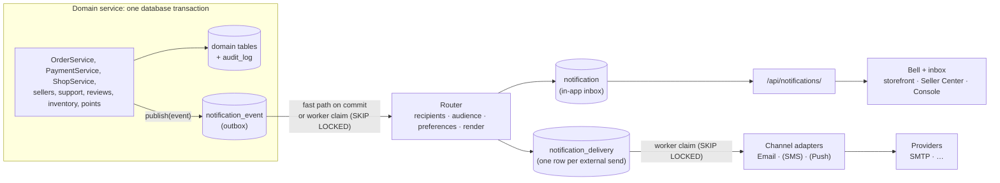

# MiniShop — Notification System Plan

**Created:** 2026-09-29 · **Baseline commit:** `6d08ef0` · **Status:** 🚧 In progress. Tasks 1–8
of 16 are done. From Task 3 on, the work is built on the §3 answers as proposed.

This is the architecture and task list for the notification system. Work through the
tasks in §14 **one at a time, in order**. Each task is one commit. When a task is done,
tick its boxes, set its **Status** line, and update the table at the top of §14.

To continue, just ask: **"do Task N"**.

> **Roadmap note.** `docs/FUTURE_PLAN.md` (2026-09-18) lists notifications under "Not in
> this roadmap". The owner asked for this system on 2026-09-29, so this plan is an
> exception to that list. Task 16 records the change in the roadmap and review docs.

---

## 1. What we are building

One platform service that tells the right person, through the right channel, when
something they care about has happened. The code that makes the thing happen doesn't
know who gets told, or how.

1. **Customers** hear about their orders, payments, refunds and support replies.
2. **Sellers** hear about new orders; decisions on their account, shops and products;
   low stock; new reviews; and points adjustments.
3. **Staff** hear about work waiting for them: shops to review, new support tickets, and
   tickets assigned to them.
4. Every notification lands in an **in-app inbox**. A bell with an unread count sits in
   the storefront header, the Seller Center and the Management Console. Selected
   notifications also go out by **email**. The design has room for **SMS** and **push**,
   but this plan doesn't build them.
5. People choose which categories reach them by email. A few categories can't be
   switched off.
6. Operators can see the backlog, failures and dead letters, and can retry them.

### Non-negotiables

| Property | What it means in MiniShop |
|---|---|
| **Decoupled** | A domain service publishes a *fact* ("order X moved from PENDING to SHIPPED"). It never picks recipients, channels or wording, and never calls a provider. Adding a channel or a recipient never touches order code. |
| **Reliable** | A notification is never lost once the business change commits, and never created if it rolls back. Crashes, provider outages and deploys only delay delivery. Every hop is idempotent. |
| **Scalable** | Workers scale out today on MySQL alone. The same interfaces can move to a message broker later without changing any producer. |
| **Observable** | Every event and every delivery has a status, an attempt count and its last error. The age of the backlog can be measured. |
| **Secure** | Recipients come from server-side data and RBAC, never from client input. A person can only ever read their own inbox. |

---

## 2. What already exists (verified 2026-09-29)

Read from the source on this date. The source and its tests are authoritative.

| Area | Finding | Consequence for this plan |
|---|---|---|
| Notifications | No notification code exists anywhere. The Master Prompt lists it as missing (`task/Master_Prompt.md` §28 item 7); so does `report.md` (line 547). | Greenfield: a new `notifications` app. |
| Support tickets | Has in-app unread markers only: `GET /api/support/tickets/unread-count/` and the seller variant (`support/views.py:191`, `:297`). The frontend re-counts on navigation and on `SUPPORT_UNREAD_EVENT` (`frontend/src/lib/support.ts:276`). | Keep them. Notifications add the bell, email and staff alerts on top (D10). |
| Domain services | State changes live in services decorated with `@transaction.atomic`: `sellers/services.py:75–95`, `ShopService` (`shops/services.py:363–436`), `OrderService` (`shop/services.py:399`, `:633`, `:700`, `:817`), `PaymentService` (`shop/payment_service.py:120`, `:196`, `:244`), `SupportTicketService` (`support/services.py:209`, `:301`, `:368`, `:519`), `ReviewService` / `ShopReviewService` (`customers/services.py:341`, `:449`), `InventoryService` (`shop/inventory_service.py:60`, `:153`), `PointService.adjust_points` (`points/services.py:204`). | These are the publish points. An event row written inside their transaction commits or rolls back with the change. |
| Audit precedent | `AuditService.log` (`audit/services.py:17`) writes in the caller's transaction. `audit` is kept a leaf app so any app can import it without a cycle (`audit/admin_mixins.py` docstring). | The publisher follows the same pattern and the same leaf rule. |
| **Transition bypass 1** | The console's `AdminShopStatusAPIView` (`shop/admin_views.py:1080`) sets `shop.status` inline instead of calling `ShopService`. The two disagree on rules: `ShopService.approve_shop` only accepts PENDING or DRAFT (`shops/services.py:384`); the view approves from any status. | Task 1 moves it onto `ShopService`. Otherwise one business fact would need two publish calls. |
| **Transition bypass 2** | Product moderation (approve, reject, publish, unpublish) exists only inline in `AdminProductStatusAPIView` (`shop/admin_views.py:1212`). `ProductService` has no moderation method. | Task 2 extracts it into `ProductService`. |
| Product submission | Products are created as DRAFT (`shop/services.py:138`), and no code path sets SUBMITTED. | There is no "product submitted" producer, so that event is not in v1. |
| RBAC | `has_user_permission` (`rbac/services.py:67`) = role grants + direct user grants + the `*` wildcard + `is_superuser`. There's no reverse lookup ("who holds code X?"). | Task 5 adds `users_with_permission()` next to it, mirroring the same rules. |
| Infrastructure | MySQL **8.0.46**, isolation READ-COMMITTED, so `SELECT … FOR UPDATE SKIP LOCKED` is available. No Redis, Celery, Channels or ASGI. `CACHES` is LocMem, `LOGGING` isn't configured, and `EMAIL_BACKEND` is Django's SMTP default with no host set, so any send today would fail. | The v1 queue runs on MySQL (D2). Email needs settings (Task 7). |
| Scheduling precedent | `support/management/commands/close_resolved_tickets.py`, run from cron or Windows Task Scheduler (`docs/SUPPORT_SYSTEM.md` Task 11). | The worker is a management command run the same way. |
| Contact data | `User.email`, `CustomerProfile.phone` (`customers/models.py:31`), `SellerProfile.business_email` / `business_phone` (`sellers/models.py:54–55`). | Email addresses exist for every audience. Phone numbers exist for a future SMS channel. |
| Frontend | Headers: `components/layout/Header.tsx` (storefront), `components/seller/SellerHeader.tsx`, `components/admin/AdminHeader.tsx`. Unread-count pattern: `profile/layout.tsx`, `SellerSidebar.tsx`. Time formatting: `formatRelativeTime` in `lib/support.ts`. | The bells go into the three headers and reuse the unread pattern. |

---

## 3. Decisions

**Status: proposed.** The owner started Task 3 without changing any of them, so the
tasks are built on these answers. Each row is the recommended answer. Changing one changes the tasks marked beside it.

| # | Question | Proposed answer | Why | Affects |
|---|---|---|---|---|
| D1 | Which channels in v1? | **In-app for every event, plus email for a defined subset** (§5). SMS and push get a channel-adapter interface only. | In-app needs no provider. Email covers the moments that matter when someone isn't in the app. SMS costs money per message and needs a Bangladeshi provider. | 7, 8–10 |
| D2 | What infrastructure? | **None new.** A MySQL *transactional outbox* plus worker processes (a management command) that claim rows with `SKIP LOCKED`. A broker (Redis or RabbitMQ with Celery) is Stage 2 (§4.6), behind the same interfaces. | No production deployment is planned (FUTURE_PLAN decision 3). One database is one less thing to run. MiniShop's volume is far below what MySQL handles. | 3–6 |
| D3 | How fresh is the in-app inbox? | Routing runs **right after commit** in the same process (fast path), and the worker sweeps up anything missed. The bell **polls the unread count every 60 s while the tab is visible**, and re-counts on navigation and after a read. No WebSockets or SSE in v1. | Seconds-level freshness without new infrastructure. Real-time push is Stage 3. | 4, 12 |
| D4 | What delivery guarantee? | **At-least-once, deduplicated at every hop** by unique keys. External channels can very rarely send twice if a worker crashes between the send and recording it. That's documented, not hidden. | Exactly-once across an SMTP boundary is impossible. Idempotent hops make duplicates invisible everywhere else. | 4–7 |
| D5 | Who counts as "staff" for an alert? | Users who hold the permission code through a **role or a direct grant**, resolved when the event is routed, so revoked staff stop receiving alerts. **Superusers are not included by `is_superuser` alone.** | Superusers would otherwise receive every staff alert on the platform. | 5 |
| D6 | Where are events published? | **Only in domain services**: one publish point per business fact. The two bypasses (§2) are consolidated first (Tasks 1–2). Editing a status field directly in the Django admin (for example the product form's status dropdown) doesn't notify. | Publishing from views duplicates logic per entry point and misses the others. | 1, 2, 8–10 |
| D7 | Where do templates live? | **In code**: Django templates versioned with the event schema. Plain text plus HTML for email. **English only in v1**, with room for i18n. | Reviewed in git like other code. Templates editable in the database are Stage 3. | 5, 7 |
| D8 | How do preferences work? | **Category × channel** toggles, stored sparsely (only what someone overrides). In-app can't be turned off for any category. Email can't be turned off for ACCOUNT (seller account decisions) or PAYMENTS. | People keep control over email without being able to miss what they must know. | 5, 11, 14 |
| D9 | How long is data kept? | Inbox notifications **180 days**; events and deliveries **90 days**; removed by a purge command. | Keeps the tables small. The audit log is the permanent record. | 15 |
| D10 | What happens to support's unread markers? | **Keep them.** Notifications add the bell, email and staff alerts. | They already work and are tested. Replacing them isn't needed. | 10 |
| D11 | What goes into an email? | The facts someone needs to act on, plus a link back to the app. **No phone numbers, no full addresses, no tokens.** | An email leaves our control once sent. | 7–10 |

---

## 4. Architecture

### 4.1 The big picture



In words: a service changes state and inserts an **event** row in the same transaction.
After the commit, a **router** turns the event into **inbox notifications** (one per
recipient) and **delivery** rows (one per recipient per external channel). **Channel
adapters** send the deliveries. Every arrow after the commit can fail and retry without
losing or duplicating anything.

### 4.2 Components

| Component | Responsibility | Lives in |
|---|---|---|
| Event registry | Each event type's name, schema version, category, required payload keys and priority. The single source of truth for the event contract. | `notifications/events.py` |
| Categories | Category list: label, locked channels, default channels. | `notifications/categories.py` |
| **Publisher** | `publish()`. The *only* thing domain code imports. It validates and writes one outbox row. | `notifications/publisher.py` |
| Outbox | `NotificationEvent` table. | `notifications/models.py` |
| Router | Claims an event, runs its handlers, applies preferences, renders, and writes inbox and delivery rows atomically. | `notifications/routing.py` |
| Handlers | One per event type: "who is told, in which audience, with which context". Domain models are imported lazily. | `notifications/handlers/*.py` |
| Audience resolver | `users_with_permission(code)`, mirroring `has_user_permission`. | `rbac/services.py` |
| Preferences | Effective channels for (user, category), locks included. | `notifications/preferences.py` |
| Renderer | Picks the template by event, version and channel; returns title, body and action URL. | `notifications/rendering.py`, `notifications/templates/notifications/…` |
| Channel adapters | `send(delivery) → SendResult`, with errors classified as transient or permanent. | `notifications/channels/{base,email}.py` |
| Worker | Claims with leases, retries with backoff, dead-letters. Has a transport seam for Stage 2. | `notifications/worker.py`, `management/commands/run_notification_worker.py` |
| Read API | Inbox, unread count, mark read, preferences. | `notifications/{views,serializers,urls}.py` → `/api/notifications/` |
| Operations | Read-only Django admin with requeue actions; health and purge commands. | `notifications/admin.py`, `management/commands/` |

### 4.3 Dependency rule (keeps it decoupled and free of import cycles)

- Domain apps import **only** `notifications.publisher` and the event-name constants in
  `notifications.events`. `publisher` imports only `notifications.models` and the two
  registries (`events.py`, `categories.py`), which import only `models`. Like `audit`,
  they're leaves.
- `notifications.handlers` import domain models **inside functions**. The router depends
  on the domain; the domain never depends on the router.
- Channel adapters know nothing about event types. Handlers know nothing about providers.
- A test (`notifications/tests/test_leaf_imports.py`, from Task 3) fails if
  `models.py`, `categories.py`, `events.py` or, from Task 4, `publisher.py` imports
  another project app.

### 4.4 The life of one event

1. **Publish.** `OrderService.transition_order_status` locks the order, changes its
   status, writes its audit row, and calls
   `publish("order.status_changed", payload={…}, aggregate=order, actor=user)`. That's one
   `INSERT` into `notification_event` (status PENDING). No network I/O happens inside the
   domain transaction.
2. **Fast path.** `publish()` registers a `transaction.on_commit` callback. After the
   commit it tries to route that event in the same process. Routing is database-only, so
   it's fast. If it fails, or the process dies, nothing is lost: the row is still PENDING.
3. **Sweep.** The worker claims PENDING rows, and PROCESSING rows whose lease has expired,
   with `SELECT … FOR UPDATE SKIP LOCKED`. Two workers never take the same row.
4. **Route.** Each event is routed in one transaction: run its handlers → resolve
   recipients → apply preferences → render → insert `notification` rows (in-app) and
   `notification_delivery` rows (email) → mark the event ROUTED. The row lock and the
   ROUTED check turn a re-run into a no-op; the unique keys are the backstop.
5. **Deliver.** The worker claims PENDING deliveries, sends them **outside** any
   transaction, then records SENT, or a retry with backoff, or DEAD.
6. **Read.** The client polls the unread count, opens the inbox, and marks items read.

### 4.5 Reliability design

**Why an outbox, and not something simpler:**

| Alternative | Why it's rejected |
|---|---|
| Django signals (`post_save`) | Implicit. They fire on every save, including admin and bulk edits, and they don't carry business intent (from which status, to which, by whom, why). |
| Sending directly in `transaction.on_commit` | Lost if the process dies between the commit and the send. No retry, no record. |
| Deriving events from `AuditLog` | Audit actions are free-form strings, not a contract. Audit coverage doesn't match what needs notifying (low stock isn't audited). It would couple the permanent record to a delivery pipeline. |
| Sending inside the domain transaction | Network I/O while row locks are held. A slow SMTP server would stall checkout. |

**Idempotency at every hop:**

| Hop | Guarantee | Key |
|---|---|---|
| Producer → outbox | A duplicate business operation creates one event. | `NotificationEvent.idempotency_key` (unique). A natural key where the fact has one (`order:{order_number}:placed`, `payment:{payment_number}:succeeded`, `refund:{refund_number}`, `support_message:{id}`). Otherwise a UUID, because the transition itself is the guard: services lock the row and check its state, so the same transition can't apply twice. |
| Outbox → inbox | Re-routing an event doesn't duplicate inbox rows. | `unique(recipient, event)` on `Notification` |
| Inbox → delivery | One send per channel per notification. | `unique(notification, channel)` on `NotificationDelivery` |
| Delivery → provider | A retried email can be recognised as the same message. | `Message-ID` header built from the delivery's UUID |

**Leases and crash recovery.** A claim sets `status=PROCESSING`,
`locked_until = now + lease` (60 s) and `locked_by = worker id`. A crashed worker's rows
become claimable again once the lease expires. There's no separate reaper process.

**Retries.** Exponential backoff with full jitter:
`delay = random(0, min(cap, base × 2^attempt))`, with base 30 s and cap 1 h. At most **5**
attempts for events and **8** for deliveries, then **DEAD**. Adapters classify errors: a
permanent failure (an SMTP 5xx, an invalid address) goes to DEAD, or SKIPPED, at once. A
transient one (a timeout, a 4xx, a refused connection) is retried.

**Poison events.** A handler that raises marks the event FAILED with backoff. After the
maximum attempts it goes to DEAD, shows up in the admin, and can be requeued once fixed.

**Ordering.** Not guaranteed across events. The inbox sorts by `occurred_at` (event time),
not by insert time. Each notification is self-contained, so arriving out of order never
shows a wrong state.

**Snapshot or re-read?** Events carry the facts the wording needs (order number, old and
new status, reason), because the notification must describe what *happened*. Handlers
re-read the database only to find *who* is responsible *now*, such as the shop owner's
user. A recipient deleted since the event is skipped.

**Backpressure.** Batch sizes are configurable, and each channel has a token-bucket rate
limit in the worker (default 10 emails/s).

### 4.6 Scalability path

| Stage | When | What changes | What stays |
|---|---|---|---|
| **1. This plan** | Now | MySQL outbox, N worker processes (`SKIP LOCKED`), polling clients. Comfortably hundreds of events per second, far above MiniShop's volume. | — |
| **2. Broker** | Sustained load above ~50 events/s, email latency hurting other work, or several consumers needing the same events | An outbox relay publishes to Redis Streams or RabbitMQ; Celery or Dramatiq workers consume per-channel queues; per-provider rate limits. | Producers, event contract, handlers, templates, API. Only the worker's transport changes. |
| **3. Real time and reach** | Product needs | SSE (ASGI) or WebSockets (Channels + Redis pub/sub) push; notifications tables partitioned by month or moved to their own database; chunked broadcast jobs; SMS and push adapters; digests; templates editable in the database; Bangla. | Same as Stage 2 |

Choices made now so that Stages 2 and 3 stay cheap: UUID event IDs, event schema
versions, the channel-adapter protocol, a transport seam in the worker, keyset
pagination, and no business logic in views.

### 4.7 Security and privacy

- **Recipients come from the server.** They're resolved from domain relations and RBAC.
  No API takes a recipient or an address from the client.
- **Your inbox only.** Every inbox query is filtered by `recipient = request.user`.
  Anyone else's ID returns 404. Task 11 tests this (IDOR).
- **Audience separation.** Each notification has `audience` ∈ {CUSTOMER, SELLER, STAFF}.
  The storefront shows CUSTOMER, the Seller Center shows SELLER, the Console shows STAFF.
  Asking for SELLER needs a seller profile, and asking for STAFF needs a staff role. A
  user who is both a seller and a customer sees each in the right place.
- **Multi-seller orders.** A seller's "new order" notification lists only that seller's
  items, using the per-item `shop` / `seller` snapshots (`shop/models.py`, `OrderItem`).
- **Content.** Templates autoescape. There are no secrets or tokens in any payload or
  email (D11), and links are paths on `STOREFRONT_URL`.
- **Revocation.** Staff audiences are resolved when the event is routed, so a revoked
  permission stops future alerts. The page an alert links to enforces permission again.
- **Throttling.** A DRF throttle on the unread-count endpoint, which is polled.
- **Audit.** Preference changes and admin requeue or purge actions write `AuditService`
  rows.

### 4.8 Observability and operations

- **Logging.** A `notifications` logger records event ID, type, attempt and outcome.
  `LOGGING` isn't configured today; Task 15 adds a minimal config for this logger.
- **Health.** `manage.py notification_health` reports pending events and the age of the
  oldest; FAILED and DEAD counts; and deliveries by status and channel. It exits non-zero
  when the oldest PENDING event is older than 5 minutes or anything is DEAD, so a
  scheduler can alert on it.
- **Retention.** `manage.py purge_notifications` applies D9.
- **Runbook** (written in Task 15): run the worker in development and in a scheduled or
  supervised setup (Windows Task Scheduler, systemd); requeue dead letters; read the
  health output.

---

## 5. Event catalog (v1)

Every producer below was checked in the source on 2026-09-29. Email marked **●** can't be
switched off (D8); **○** is on by default and can be switched off; **—** means no email.

### Customer-facing

| Event | Published by | Told | Category | Email | Idempotency key |
|---|---|---|---|---|---|
| `order.placed` | `OrderService.create_order_from_cart` (`shop/services.py:399`) | order's customer (CUSTOMER) | ORDERS | ○ | `order:{order_number}:placed` |
| ↳ same event, second handler | — | each seller with items in the order, with only their own items (SELLER) | SELLER_ORDERS | ○ | (event, recipient) |
| `order.status_changed` | `OrderService.transition_order_status` (`:633`), `transition_seller_order_status` (`:817`), `cancel_customer_order` (`:700`) | customer, for CONFIRMED, SHIPPED, DELIVERED, CANCELLED. Sellers of the order when the *customer* cancels. | ORDERS / SELLER_ORDERS | ○ for SHIPPED, DELIVERED, CANCELLED | UUID (the transition is guarded) |
| `payment.succeeded` | `PaymentService.process_payment_success` (`shop/payment_service.py:120`) | customer | PAYMENTS | ● | `payment:{payment_number}:succeeded` |
| `payment.failed` | `PaymentService.process_payment_failure` (`:196`) | customer | PAYMENTS | ● | UUID (a failed payment can be retried and fail again; changed in Task 8) |
| `refund.processed` | `PaymentService.process_refund` (`:244`) | customer | PAYMENTS | ● | `refund:{refund_number}` |
| `support.reply_received` | `SupportTicketService.add_staff_message` (`support/services.py:368`), **public replies only** | ticket owner, CUSTOMER or SELLER per the ticket's channel | SUPPORT | ○ | `support_message:{id}` |

### Seller-facing

| Event | Published by | Told | Category | Email | Idempotency key |
|---|---|---|---|---|---|
| `seller.status_changed` | `approve_seller` / `reject_seller` / `suspend_seller` / `reactivate_seller` (`sellers/services.py:75–95`) | the seller's user | ACCOUNT | ● | UUID |
| `shop.status_changed` | `ShopService.approve_shop` / `reject_shop` / `suspend_shop` / `reactivate_shop` (`shops/services.py:382–436`); after Task 1, the Console route too | shop owner | SHOPS | ○ | UUID |
| `product.moderated` | After Task 2: `ProductService` approve / reject / publish / unpublish (today inline at `shop/admin_views.py:1212`) | shop owner | CATALOG | ○ for rejections only | UUID |
| `inventory.low_stock` | `InventoryService.adjust_stock` (`shop/inventory_service.py:60`) and `reserve_stock_for_cart` (`:153`), when available stock *crosses* the threshold | shop owner | INVENTORY | — | `low_stock:{product_id}:{yyyy-mm-dd}` (at most one a day per product) |
| `review.created` | `ReviewService.create_review` (`customers/services.py:341`), `ShopReviewService.create_review` (`:449`) | shop owner | REVIEWS | — | `review:{kind}:{id}` |
| `points.adjusted` | `PointService.adjust_points` (`points/services.py:204`) | the seller's user | WALLET | — | `points_txn:{id}` |

### Staff-facing

| Event | Published by | Told | Category | Email | Idempotency key |
|---|---|---|---|---|---|
| `shop.submitted` | `ShopService.submit_for_review` (`shops/services.py:363`) | holders of `shops.approve` (STAFF) | STAFF_QUEUE | — | UUID |
| `support.ticket_created` | `SupportTicketService.create_ticket` (`support/services.py:209`) | holders of `support.staff.manage`, the people who assign (STAFF) | STAFF_QUEUE | — | `support_ticket:{ticket_number}:created` |
| `support.ticket_assigned` | `SupportTicketService.assign` (`:519`) | the assignee | STAFF_QUEUE | ○ | UUID |
| `support.customer_replied` | `SupportTicketService.add_customer_reply` (`:301`) | the assignee, if there is one | STAFF_QUEUE | — | `support_message:{id}` |

### Deliberately not in v1

- `product.submitted`: no code path sets SUBMITTED (§2), so there is nothing to publish.
- Security emails and password reset: no such flows exist.
- Review-moderation outcomes to review authors, marketing and broadcasts, digests: §16.

---

## 6. Data model (`backend/notifications/models.py`)

All four tables are new. No existing table changes.

**`NotificationEvent`**, the outbox:

| Field | Type | Notes |
|---|---|---|
| `id` | UUID, primary key | Generated in Python, so it's known before the insert. |
| `event_type` | char(64), indexed | A registry name, such as `order.status_changed`. |
| `schema_version` | positive small integer | From the registry. |
| `aggregate_type` / `aggregate_id` | char(64) / char(64) | For example `Order` / `42`. Used for tracing only. |
| `actor` | FK user, SET_NULL, nullable | Who caused it. |
| `payload` | JSON | The fact snapshot. Validated against the registry's required keys. |
| `idempotency_key` | char(191), **unique** | See §4.5. |
| `occurred_at` | datetime | Business time. The inbox sorts by this. |
| `status` | PENDING · PROCESSING · ROUTED · FAILED · DEAD | |
| `attempts` | positive small integer | |
| `available_at` | datetime | Next time it may be claimed (backoff). |
| `locked_until` / `locked_by` | datetime, nullable / char(64) | The lease. |
| `last_error` | text | Truncated to 2 KB. |
| `routed_at`, `created_at` | datetime | |

Index: (`status`, `available_at`) for claiming.

**`Notification`**, the inbox (one row per recipient per event):

| Field | Type | Notes |
|---|---|---|
| `id` | big auto | |
| `recipient` | FK user, CASCADE | |
| `event` | FK `NotificationEvent`, SET_NULL, nullable | Events are purged sooner (D9). |
| `event_type`, `category` | char | Copied, so the inbox never needs the event. |
| `audience` | CUSTOMER · SELLER · STAFF | Which surface shows it (§4.7). |
| `title` | char(200) | Rendered. |
| `body` | text | Rendered, plain text. |
| `action_url` | char(500) | An app path, never an absolute URL to someone else's site. |
| `priority` | NORMAL · HIGH | |
| `occurred_at`, `created_at` | datetime | |
| `read_at` | datetime, nullable | |

Constraints and indexes: `unique(recipient, event)`; (`recipient`, `audience`, `read_at`)
for unread counts; (`recipient`, `audience`, `-occurred_at`, `-id`) for keyset pages.

**`NotificationDelivery`**, one per external channel per notification:

| Field | Type | Notes |
|---|---|---|
| `id` | UUID, primary key | Also the email `Message-ID`. |
| `notification` | FK `Notification`, CASCADE | |
| `channel` | EMAIL (SMS and PUSH reserved) | |
| `destination` | char(254) | The address snapshot at routing time. |
| `status` | PENDING · PROCESSING · SENT · FAILED · DEAD · SKIPPED | SKIPPED = no address, or a permanent refusal. |
| `attempts`, `available_at`, `locked_until`, `locked_by`, `last_error` | as on the event | |
| `provider_message_id` | char(255) | |
| `sent_at`, `created_at` | datetime | |

Constraint: `unique(notification, channel)`. Index: (`status`, `available_at`).

**`NotificationPreference`**, sparse overrides:

| Field | Type | Notes |
|---|---|---|
| `user` | FK user, CASCADE | |
| `category` | char(32) | A registry category. |
| `channel` | char(16) | |
| `enabled` | bool | |
| `updated_at` | datetime | |

Constraint: `unique(user, category, channel)`. No row means the category's default.

---

## 7. Permissions (new codes in `seed_rbac.py`)

- Reading your own inbox and preferences needs **no permission code**, only an
  authenticated user. It's personal data about yourself.
- `notifications.admin.view`: see events, inbox rows and deliveries in the Django admin.
  Granted to ADMINISTRATOR, SUPER_ADMINISTRATOR and OPERATION_MANAGER.
- `notifications.admin.manage`: requeue dead letters, run purges from the admin. Granted
  to ADMINISTRATOR and SUPER_ADMINISTRATOR.
- Both codes go into `FORBIDDEN_ROLE_PERMISSIONS[CUSTOMER]`, as the `support.staff.*`
  codes do.

---

## 8. API contract (`/api/notifications/`, JWT as elsewhere)

| Method and path | Purpose | Response |
|---|---|---|
| `GET /?audience=CUSTOMER\|SELLER\|STAFF&unread=1&cursor=…` | Inbox, newest first, 20 a page | `{results: [{id, event_type, category, title, body, action_url, priority, occurred_at, read_at}], next_cursor}` |
| `GET /unread-count/?audience=…` | The bell badge | `{unread: n}` (throttled) |
| `POST /{id}/read/` | Mark one read | `204`; `404` if it isn't yours |
| `POST /read-all/?audience=…` | Mark all read | `{updated: n}` |
| `GET /preferences/` | Toggles for the categories that apply to you | `[{category, label, channels: {in_app: {enabled, locked}, email: {enabled, locked}}}]` |
| `PUT /preferences/` | Change toggles | Same shape. Changing a locked toggle → `400`. |

`audience=SELLER` needs a seller profile; `audience=STAFF` needs a staff role. Otherwise
the request gets `403`.

---

## 9. UI and UX

- **Bell.** An icon button with a count badge (shown as "99+" past 99) and screen-reader
  text ("3 unread notifications"). The dropdown shows the 10 newest: a category icon,
  title, a one-line body, relative time and an unread dot, plus **Mark all read** and
  **View all**. Keyboard navigable, Escape closes it, and focus returns to the bell.
- **Where it goes.** The storefront `Header.tsx` (customers) opens
  `/profile/notifications`. `SellerHeader.tsx` opens `/seller/notifications`.
  `AdminHeader.tsx` opens `/admin/notifications`.
- **Inbox page.** All / Unread filter, "Load more" (keyset), and loading, empty and error
  states. Clicking an item marks it read and opens its `action_url`.
- **Preferences.** A categories × channels table of toggles. Locked toggles are disabled,
  with the note "Required". Reached from each inbox page.
- **Style.** Design tokens only (`bg-surface`, `text-ink`, `text-accent`…, AGENTS.md rule
  3); `formatRelativeTime` from `lib/support.ts`; the existing feedback components for
  errors.
- **Freshness.** Poll the unread count every 60 s while `document.visibilityState` is
  `visible`. Re-count on navigation and on a `minishop:notifications-changed` window event
  (the pattern from `SUPPORT_UNREAD_EVENT`).

---

## 10. Performance

- The unread count is an index range count on (`recipient`, `audience`, `read_at`). At a
  60 s poll per visible tab this is negligible; the DRF throttle caps misuse.
- The inbox uses keyset pagination on (`occurred_at`, `id`), never `OFFSET`.
- The worker claims batches of 50, polls every 2 s when there's work, and backs off to
  10 s when idle.
- Staff audiences are small. One event's fan-out is capped at 500 recipients, with a
  warning logged beyond that; larger broadcasts are Stage 3 chunked jobs.
- The outbox and delivery tables are bounded by the purge (D9).

---

## 11. Database and migration impact

- One new app with four new tables and a single `0001_initial` migration. No changes to
  existing tables.
- Tasks 1–2 refactor code only; there's no schema change.
- `seed_rbac` gains two codes.
- **Test databases:** after the new migration, drop the stale `test_minishop_N` clones
  before the next `--parallel --keepdb` run. `--keepdb` reuses clones without
  re-migrating them.

---

## 12. Files likely to change

**New:** `backend/notifications/` (`apps.py`, `models.py`, `events.py`, `categories.py`,
`publisher.py`, `routing.py`, `handlers/`, `preferences.py`, `rendering.py`, `channels/`,
`worker.py`, `views.py`, `serializers.py`, `urls.py`, `admin.py`, `management/commands/`,
`templates/notifications/`, `tests/`); `frontend/src/lib/notifications.ts`;
`frontend/src/components/notifications/`; `frontend/src/app/{profile,seller,admin}/notifications/`.

**Changed:** `config/settings/{base,dev}.py` (app, `NOTIFICATIONS`, email, logging);
`config/urls.py`; `rbac/services.py`; `rbac/management/commands/seed_rbac.py`;
`shops/services.py` and `shop/admin_views.py` (Task 1); `shop/services.py` (Tasks 2, 8);
`shop/payment_service.py`; `sellers/services.py`; `support/services.py`;
`customers/services.py`; `shop/inventory_service.py`; `points/services.py`;
`shop/admin.py` (the low-stock threshold moves to a shared constant); the three header
components.

---

## 13. Testing plan

**Backend.** All against the MySQL test database, so `SKIP LOCKED` is the real thing.

- **Publisher.** Rollback → no row; commit → one row; duplicate key → one row, and the
  outer transaction survives; missing payload keys and non-JSON payloads → errors.
- **Router.** Re-routing is a no-op. A preference that's off → an inbox row but no
  delivery row. A locked category ignores the opt-out. A deleted recipient is skipped.
  Audiences are right. A multi-seller order gives each seller only their own items. The
  fan-out cap holds.
- **Audience resolver.** Agrees with `has_user_permission` across a matrix of roles,
  direct grants, the wildcard and superusers (D5).
- **Worker.** Two workers in separate threads and connections never process the same
  row. An expired lease is reclaimed. A failure → FAILED with a future `available_at`.
  Maximum attempts → DEAD. A permanent error → DEAD or SKIPPED at once. `--once` exits.
- **Email.** Django's locmem backend: subject, text and HTML bodies, the `Message-ID`
  header, error classification.
- **Producers.** Each publishes exactly one event, with the right payload, inside its
  transaction. A rejected transition publishes nothing.
- **API.** The IDOR matrix (someone else's ID → 404); audience permissions; the throttle;
  read-all scoped to the audience; locked preferences refuse changes.
- **Templates.** Every event type with a handler has its in-app template, and email's shared layout exists (email wraps the rendered notification; see Task 7).

**Frontend.** `npx tsc --noEmit`; `npm run build`; a browser check with system
`google-chrome --headless=new` (Playwright's Chromium doesn't hydrate this app). Check the
bell badge, dropdown, mark read, inbox paging and preferences, in light and dark, desktop
and phone widths.

---

## 14. Implementation breakdown

| Task | Title | Side | Status |
|---|---|---|---|
| 1 | Consolidate shop status transitions into `ShopService` | backend (prerequisite) | ✅ Done |
| 2 | Move product moderation into `ProductService` | backend (prerequisite) | ✅ Done |
| 3 | `notifications` app: models, migration, registry, admin, permission codes | backend | ✅ Done |
| 4 | Publisher: `publish()`, idempotency, on-commit fast path, settings | backend | ✅ Done |
| 5 | Router: audiences, handlers, preferences, rendering | backend | ✅ Done |
| 6 | Worker: claims, leases, retries, dead letters, `run_notification_worker` | backend | ✅ Done |
| 7 | Email channel: adapter, layout templates, settings | backend | ✅ Done |
| 8 | Producers, wave 1: orders and payments | backend | ✅ Done |
| 9 | Producers, wave 2: seller and shop lifecycle, shop submitted | backend | ⬜ Not started |
| 10 | Producers, wave 3: product moderation, support, reviews, low stock, points | backend | ⬜ Not started |
| 11 | Inbox and preferences API | backend | ⬜ Not started |
| 12 | Frontend foundation: types, client, polling hook, bell component | frontend | ⬜ Not started |
| 13 | Frontend surfaces: bells in three headers, three inbox pages | frontend | ⬜ Not started |
| 14 | Preferences UI | frontend | ⬜ Not started |
| 15 | Operations: admin actions, health and purge commands, logging, runbook | backend + docs | ⬜ Not started |
| 16 | Regression run and documentation close-out | docs | ⬜ Not started |

**Milestones.** After Task 8, order and payment notifications reach the inbox (visible
through the Django admin) and email, when the worker runs. **After Task 13 the feature is
usable end to end in the apps.** Tasks 14–16 complete it.

### Task 1 — Consolidate shop status transitions into `ShopService` (prerequisite)

**Goal.** One code path changes a shop's status, so one place can publish the event (D6).

- [x] List every difference between `AdminShopStatusAPIView` (`shop/admin_views.py:1080`)
      and `ShopService.approve_shop` / `reject_shop` / `suspend_shop` / `reactivate_shop`
      (`shops/services.py:382–436`): allowed source statuses, and fields set
      (`approved_at`, `reviewed_by`, `reviewed_at`, `suspended_at`, `suspension_reason`,
      `rejection_reason`).
- [x] Settle each difference with the owner and record the answers under **Status**. For
      example: can the Console approve a SUSPENDED shop?
- [x] The view calls `ShopService`. It keeps its RBAC checks, `select_for_update`,
      `AuditService` row and response shape; the service's errors map to `400`.
- [x] Tests: the existing Console shop-status tests pass unchanged, and there's a test
      for each rule the answers changed. *(One existing test had to change; see below.)*

**Done when.** A grep finds no assignment to `Shop.status` for these four actions outside
`ShopService`, and `manage.py test shops shop.test_admin_governance` passes.

**Status:** ✅ Done (2026-09-29). `check`, `makemigrations --check`, `npx tsc --noEmit` and
`npm run build` are clean. **The backend tests haven't been run yet.** The owner asked for
the test suite to run once, in Task 16, rather than after each task.

**Differences found.** Before this task the Console accepted every action from every
status. Its UI (`getStatusRelevantActions` in `frontend/src/app/admin/shops/shopGovernance.tsx`)
offered only some of them.

| Action | Console API before | `ShopService` before | Console UI offered | Rule now, on every path |
|---|---|---|---|---|
| approve | any status | PENDING, DRAFT | DRAFT, PENDING, REJECTED | PENDING, DRAFT, **REJECTED** |
| reject | any status | PENDING | DRAFT, PENDING | PENDING. The UI no longer offers it on DRAFT. |
| suspend | any status | ACTIVE, APPROVED | APPROVED, ACTIVE | ACTIVE, APPROVED |
| reactivate | any status | SUSPENDED | SUSPENDED | SUSPENDED |

Fields set:

- **approve:** the service clears `rejection_reason`; the Console didn't. A Console-approved
  shop that had been rejected kept its old reason, and the detail page showed it in red on a
  live shop. The service's rule applies now. `approved_at` and `reviewed_at` now share
  one timestamp, where the service used to call `now()` twice.
- **Every other field was the same on both paths.** Reject sets `rejection_reason`,
  `reviewed_by` and `reviewed_at`. Suspend sets `suspension_reason` and `suspended_at`.
  Reactivate clears `suspension_reason`. Neither path clears `suspended_at` on
  reactivation, so it keeps recording the last suspension. That hasn't changed.

**Answers.** The owner asked for Task 1 to go ahead without settling each difference one
by one, so each got the recommended answer. Every rule lives only in `ShopService`, so
changing one later is a one-line change there.

1. **Approving a REJECTED shop: allowed on every path.** Staff can reverse a mistaken
   rejection without the seller resubmitting, and the old reason is cleared. The Console
   already offered this. The Django-admin action and `/api/shops/staff/…/approve/` gain it
   too, because they call the same service.
2. **Rejecting a DRAFT shop: refused.** No one asked for a review, so there is nothing to
   reject. Approving a DRAFT stays allowed, since staff-created shops start as DRAFT.
3. **Every other path the Console used to accept is refused with `400`.** That covers
   suspending a PENDING shop, "reactivating" a PENDING shop straight to ACTIVE with no
   review, rejecting an ACTIVE shop, approving a SUSPENDED shop, and so on.

**What changed.**

- `ShopService.approve_shop` accepts REJECTED and uses a single timestamp.
- `AdminShopStatusAPIView` locks the row, calls the service and writes its audit row as
  before. An `InvalidShopTransitionError` becomes a `400` whose body is a bare list of
  messages; the Console already displays that shape, as it does for the product-publish
  precondition. Nothing is saved and no audit row is written.
- The Console hides Reject on DRAFT shops, and its comment no longer says the backend has
  no source-status rules.
- **One existing test changed.** `shop/test_admin_phase1.py`
  `test_admin_with_manage_permission_can_suspend_shop` suspended a PENDING shop, which
  rule 3 refuses, so its fixture now moves the shop to ACTIVE first.
- New tests: `AdminShopStatusTransitionRuleTests` in `shop/test_admin_governance.py`
  covers every allowed transition (7 cases, one audit row each), every refused one
  (10 cases: `400`, nothing changed, no audit row), and the cleared rejection reason.
  `shops/tests.py` covers approving a REJECTED shop at the service level, and the service
  refusing to approve ACTIVE and SUSPENDED shops.
- Grep: outside `ShopService`, only `shop/management/commands/seed_showcase.py:312`
  assigns `Shop.status`. It's a development seed command that builds demo data, not one of
  the four staff actions.

### Task 2 — Move product moderation into `ProductService` (prerequisite)

**Goal.** Product approve, reject, publish and unpublish live in the service layer.

- [x] `ProductService.approve` / `reject` / `publish` / `unpublish(product, actor, reason="", ip_address=None)`
      with *exactly* today's rules from `AdminProductStatusAPIView`
      (`shop/admin_views.py:1212–1285`), including publish's shop and seller eligibility
      checks.
- [x] One `AuditService` row per action, written by the service. The view no longer
      writes its own.
- [x] The view keeps its RBAC mapping and delegates.
- [x] Tests: every action and every refusal; exactly one audit row per action.

**Done when.** Moderation status assignments exist only in `ProductService`, and the
product-moderation tests pass.

**Status:** ✅ Done (2026-09-29). `check`, `makemigrations --check` and an import check are
clean. **The backend tests haven't been run yet;** they run in Task 16, as the owner asked.

**What moved.** The four actions now live in `ProductService` in `shop/services.py`, with
the same rules the view had:

| Action | Sets | Refused when |
|---|---|---|
| approve | `APPROVED`, `reviewed_by`, `reviewed_at`; clears `rejection_reason` | never |
| reject | `REJECTED`, `rejection_reason` (trimmed), `reviewed_by`, `reviewed_at` | the reason is blank (`Product.clean()`; the serializer checks first) |
| publish | `PUBLISHED`, `is_active = True` | there's no shop, the shop isn't APPROVED or ACTIVE, or its owner isn't operational |
| unpublish | `UNPUBLISHED` | never |

- **No source-status rule, as before.** Any action applies from any status.
- **The publish refusals** raise a new `ProductModerationError`. The view turns it into the
  same `400` bare message list as before, with the same wording.
- **The audit row is written by the service,** one per action. It has the same
  `ADMIN_PRODUCT_<ACTION>` names, the same previous and new state, and the same IP. The view
  no longer writes one.
- **One wording fix.** The default audit reason used to read "Product approveed by staff".
  It's now "Product approved by staff"; the other three actions read the same as before.
- **The view keeps** its RBAC mapping, `select_for_update` and response shape, and maps a
  service `ValidationError` to `400`.
- **Grep:** outside `ProductService`, only the development seed commands `seed_demo_data`
  and `seed_showcase` assign a moderation status. They build demo data and aren't staff
  actions.
- **Tests:** a new file, `shop/test_product_moderation.py`. It covers each action's fields;
  a blank reject reason; publish refused for each non-live shop status, for no shop, and for
  a pending or suspended seller; every action from every status; exactly one audit row per
  action, through both the service and the Console endpoint; and the `400` body. The
  existing Console product tests in `shop/test_admin_governance.py` haven't changed.

### Task 3 — `notifications` app: models, migration, registry, admin, permission codes

**Goal.** The storage and the event contract exist. Nothing publishes yet.

- [x] Create the app and add it to `INSTALLED_APPS`.
- [x] Models exactly as §6: choices, constraints, indexes, `__str__`.
- [x] Migration `0001_initial`.
- [x] `categories.py` (§5 categories with label, locked and default channels) and
      `events.py` (the §5 catalog: name, version, category, required keys, priority).
- [x] A read-only Django admin for the four models, with filters and search.
- [x] `seed_rbac.py`: the two §7 codes, their grants, and the CUSTOMER denylist.
- [x] Tests: unique constraints; every event's category exists; versions are at least 1;
      the leaf-import rule (§4.3); seed grants.

**Done when.** `manage.py test notifications` passes, `check` is clean,
`makemigrations --check` reports no changes, and the stale test clones are dropped (§11).

**Status:** ✅ Done (2026-09-29).

- **Checks run:** `check` and `makemigrations --check` are clean. The registry and
  leaf-import tests (17, no database needed) pass.
- **Not run yet:** the model, seed and admin tests. They need the test database and run in
  Task 16, as the owner asked.
- **Dev database:** `0001_initial` is applied and `seed_rbac` re-run on it, which added
  2 codes and 5 role links.
- **Stale test clones:** the 16 `test_minishop_N` clones were already stale at 42
  migrations, so they were dropped.

**What exists now** (`backend/notifications/`):

- **`models.py`: the four §6 tables, each with the §6 constraints and indexes.**
  - `Audience`, `Channel` and `Priority` are the shared choice lists.
  - Event types and categories are plain strings checked against the registries, not
    model choices, so adding one needs no migration.
  - `Channel` holds `IN_APP` and `EMAIL` only; SMS and push get a value when they get an
    adapter.
  - One addition to §6: a check constraint stops a `NotificationDelivery` from ever using
    `IN_APP`, because the inbox row already is the in-app channel.
  - Tables use Django's default names (`notifications_notificationevent` and so on), not
    the shorter names in the §4.1 diagram.
- **`categories.py`: the 11 categories.**
  - Each has a label, `default_channels` (the channels it uses, on until switched off) and
    `locked_channels`.
  - In-app is locked everywhere; email is locked for ACCOUNT and PAYMENTS (D8).
  - INVENTORY, REVIEWS and WALLET have no email at all, so they show no email toggle.
- **`events.py`: the 16 §5 event types, each with a name constant for producers.**
  - **Where §5 is followed more closely than §4.2 says:** §4.2 gives each event *one*
    category, but §5 files `order.placed` and `order.status_changed` under ORDERS for the
    customer and SELLER_ORDERS for sellers. So each entry maps **audience → category**.
    That map also records who the event can reach.
  - `channels`: every event uses in-app. Email is listed where §5 has ● or ○; handlers and
    preferences can narrow it, never widen it.
  - Priority is HIGH for `payment.failed` and `seller.status_changed`, which need someone
    to act. Everything else is NORMAL.
  - Money travels as a decimal string, since payloads are JSON.
  - The required keys below are the v1 contract for Tasks 8–10. Adding a key needs no new
    version; removing or renaming one does.
- **`admin.py`:** a read-only admin for all four models, with filters and search.
  - Viewing needs the MiniShop code `notifications.admin.view`, not Django's model
    permissions, because inbox rows are personal data.
  - Nothing can be added, changed or deleted there. Requeue arrives in Task 15.
- **`seed_rbac.py`:**
  - `notifications.admin.view` goes to ADMINISTRATOR and OPERATION_MANAGER.
  - `notifications.admin.manage` goes to ADMINISTRATOR.
  - SUPER_ADMINISTRATOR gets both through its all-codes grant.
  - Both codes are on the CUSTOMER denylist.
  - `rbac/widgets.py` gives the new resource a "Notifications" group on the permission
    board.
- **Tests (`notifications/tests/`):**
  - models: every unique key, the external-only delivery rule, NULL events after a purge,
    and cascades;
  - registry: the catalog is exactly §5, and categories, audiences, versions, keys,
    channels and locks all line up;
  - leaf imports, covering `models.py`, `categories.py` and `events.py` (Task 4 adds the
    publisher);
  - seed grants;
  - admin access and read-only behaviour.

| Event | Required payload keys |
|---|---|
| `order.placed` | `order_id`, `order_number`, `total_amount`, `items` (`[{product_name, quantity, line_total, seller_id}]`, added in Task 8) |
| `order.status_changed` | `order_id`, `order_number`, `from_status`, `to_status`, `changed_by` (CUSTOMER · SELLER · STAFF) |
| `payment.succeeded`, `payment.failed` | `payment_id`, `payment_number`, `order_number`, `amount` |
| `refund.processed` | `refund_id`, `refund_number`, `order_number`, `amount` |
| `support.reply_received`, `support.customer_replied` | `ticket_id`, `ticket_number`, `message_id` |
| `seller.status_changed` | `seller_id`, `from_status`, `to_status` |
| `shop.status_changed` | `shop_id`, `shop_name`, `from_status`, `to_status` |
| `product.moderated` | `product_id`, `product_name`, `action`, `from_status`, `to_status` |
| `inventory.low_stock` | `product_id`, `product_name`, `available_stock`, `threshold` |
| `review.created` | `kind` (product · shop), `review_id`, `rating`, `subject_name` |
| `points.adjusted` | `transaction_id`, `seller_id`, `transaction_type`, `amount`, `balance_after` |
| `shop.submitted` | `shop_id`, `shop_name` |
| `support.ticket_created` | `ticket_id`, `ticket_number`, `subject`, `channel` |
| `support.ticket_assigned` | `ticket_id`, `ticket_number`, `assignee_id` |

### Task 4 — Publisher: `publish()`, idempotency, on-commit fast path, settings

**Goal.** Domain code has one safe call for recording a fact.

- [x] `publish(event_type, *, payload, aggregate, actor=None, idempotency_key=None, occurred_at=None)`
      → `NotificationEvent`. It validates against the registry and requires an open
      transaction (`connection.in_atomic_block`).
- [x] A duplicate `idempotency_key` returns the existing event, using a savepoint so the
      caller's transaction survives the `IntegrityError`.
- [x] Registers a `transaction.on_commit` fast path (a no-op until Task 5) behind
      `NOTIFICATIONS["ROUTE_ON_COMMIT"]`.
- [x] A `NOTIFICATIONS` settings block: batch size, lease, backoff base and cap, maximum
      attempts, rate limit, sender address, fan-out cap.
- [x] Tests: the publisher list in §13.

**Status:** ✅ Done (2026-09-29).

- **Checks run:** `check` is clean. The 25 tests that need no database pass: the
  publisher's refusals, the registry tests and the leaf-import tests.
- **Not run yet:** the database-backed publisher tests (commit, rollback, duplicate key,
  savepoint and fast path). They run in Task 16, as the owner asked.

**What exists now:**

- **`notifications/publisher.py`, `publish()`.** It checks everything before any query:
  - the event type is in the registry;
  - the payload is a dict, has every required key, and is plain JSON (no `Decimal`,
    datetime, set or NaN);
  - the aggregate is a saved instance with an id of 64 characters or fewer;
  - the key is 191 characters or fewer;
  - `occurred_at` is timezone-aware;
  - a transaction is open.

  Any failure raises `PublishError`, or `InvalidPayloadError` for the payload.
- **What gets stored.**
  - The payload is stored as a JSON round-tripped copy, so the caller can't change it
    afterwards.
  - An anonymous actor is stored as NULL.
  - The event type and version come from the registry.
  - `aggregate_type` is the model's class name.
- **Duplicate keys.** The insert runs in its own savepoint. If the key already exists,
  `publish()` returns the first event and the caller's transaction carries on.
  - If that key belongs to a *different* event type, it raises `PublishError`, because
    that's a producer bug.
  - A duplicate doesn't queue a second fast path.
- **The fast path.** `transaction.on_commit` calls `route_after_commit(event_id)`, which
  does nothing until Task 5.
  - An exception in it is logged on `notifications.publisher` and never reaches the
    caller, whose change is already committed.
  - It's controlled by `NOTIFICATIONS["ROUTE_ON_COMMIT"]`.
- **Settings.** `NOTIFICATIONS` in `config/settings/base.py` holds:
  - `ROUTE_ON_COMMIT` and `FANOUT_CAP` (500);
  - `BATCH_SIZE` (50) and `LEASE_SECONDS` (60);
  - `BACKOFF_BASE_SECONDS` (30) and `BACKOFF_CAP_SECONDS` (3600);
  - `EVENT_MAX_ATTEMPTS` (5) and `DELIVERY_MAX_ATTEMPTS` (8);
  - `EMAIL_RATE_PER_SECOND` (10);
  - `FROM_EMAIL`, which comes from the `NOTIFICATIONS_FROM_EMAIL` environment variable.

  Code reads these through `notifications.conf.notification_setting(name)`, which falls
  back to the defaults in `conf.py`, so a test can override a single key.
- **Leaf rule.** `conf.py` and `publisher.py` joined the leaf-import test.
- **Tests:** `notifications/tests/test_publisher.py` covers the §13 publisher list:
  - every refusal (these need no database);
  - commit gives one PENDING row with every field set;
  - rollback leaves no row;
  - a duplicate key gives one row, and the same transaction can keep writing;
  - a key reused by another event type is refused;
  - generated keys are unique;
  - the payload is a snapshot;
  - the fast path runs only after the commit, a failure in it is swallowed, and it can be
    switched off.

### Task 5 — Router: audiences, handlers, preferences, rendering

**Goal.** A PENDING event becomes inbox and delivery rows, exactly once.

- [x] `rbac.services.users_with_permission(code)` mirroring `has_user_permission`
      (roles, direct grants, `*`), with superusers per D5, plus the agreement tests.
- [x] A handler registry (`@handles("…")` → recipients with audience and context).
- [x] `preferences.effective_channels(user, category)` with locks (D8).
- [x] Rendering: the template per event, version and channel, giving title, body and
      `action_url`. A missing template fails the template-coverage test.
- [x] `route_event(event_id)` in one transaction: lock the event; skip it if ROUTED;
      bulk-insert inbox and delivery rows; mark ROUTED. Apply the fan-out cap. Connect the
      Task 4 fast path.
- [x] Tests: the router list in §13, using a test-only event type (real handlers come in
      Tasks 8–10).

**Status:** ✅ Done (2026-09-29).

- **Checks run:** `check` and `makemigrations --check` are clean. The 36 tests that need no
  database pass, including rendering and template coverage.
- **Not run yet:** the database-backed tests (router, preferences, fast path and the RBAC
  agreement matrix). They run in Task 16, as the owner asked.

**What exists now:**

- **`rbac.services.users_with_permission(code)`** returns a queryset of the users who hold
  `code`. That means an active role, through an active assignment, that grants the code,
  grants `*`, or is SUPER_ADMINISTRATOR; or an active direct grant of the code or `*`.
  - **Two deliberate differences from `has_user_permission`:** `is_superuser` alone
    doesn't count (D5), and inactive accounts are left out, because they can't sign in.
  - **SUPER_ADMINISTRATOR role holders are included,** because D5 counts anyone who holds
    the code through a role. The role holds every code, so they get every staff alert.
    If that's too noisy, handlers can narrow the audience; §15 item 7 already notes this
    for support tickets.
- **`notifications/handlers/`:**
  - `@handles(event_type)` registers a function that takes an event and yields
    `Recipient(user, audience, context={}, channels=None)`.
  - `context` adds template variables for that one recipient.
  - `channels` narrows the external channels, e.g. email only for some statuses; in-app
    is always kept.
  - Handlers run in registration order. `NotificationsConfig.ready()` imports the
    package, which will import one module per area in Tasks 8–10.
- **`preferences.py`:** `effective_channels(user, category)` gives the category's default
  channels, minus those switched off, but locked channels always stay.
  `load_overrides()` fetches the preferences for every recipient of an event in one query.
- **`rendering.py`:**
  - The template for an event is `notifications/<event_type>/v<version>/<channel>.txt`.
  - The in-app template has `title`, `body` and `action_url` blocks, each rendered and
    stripped.
  - The output is plain text and isn't HTML-escaped, because the apps escape it on
    display. HTML email (Task 7) will autoescape.
  - A title longer than 200 characters is shortened with "…".
  - `action_url` must be an app path starting with `/`. `//host`, `/\host`, absolute
    URLs, relative paths and links over 500 characters are refused.
  - A missing template or block fails loudly.
- **`routing.py` `route_event(event_id, skip_locked=False)`**, in one transaction:
  1. It locks the event with `select_for_update` and leaves it alone if it's ROUTED or
     DEAD.
  2. It runs the handlers. A recipient whose audience the event doesn't reach is refused.
  3. It keeps one row per user (the first audience wins, because `unique(recipient, event)`
     allows one inbox row) and re-reads users in one query, so anyone deleted or
     deactivated since is skipped.
  4. It applies `FANOUT_CAP` and logs a warning when the cap bites.
  5. It works out the channels: the event's, then the person's preferences, then the
     handler's narrowing, with in-app always kept.
  6. It renders each inbox row and bulk-inserts the inbox rows, then the delivery rows.
     There's no `INSERT IGNORE`: on MySQL that would also turn truncation errors into
     warnings.
  7. It marks the event ROUTED.

  **Error handling:** any exception rolls all of it back and propagates, and the event
  stays as it was for the worker (Task 6) to retry.

  **Email address:** the router records the address at routing time. For now it's
  `User.email`; with no address, the delivery row is SKIPPED. Task 7 adds the seller's
  business email.
- **The fast path is connected.** `publisher.route_after_commit()` calls
  `route_event(event_id, skip_locked=True)`, so a request never waits on an event a worker
  is holding.
- **Tests:**
  - `rbac/test_users_with_permission.py`: a 13-account matrix and agreement with
    `has_user_permission`.
  - `notifications/tests/`:
    - `test_preferences.py`;
    - `test_rendering.py`;
    - `test_template_coverage.py`: every event type with a handler has its in-app
      template;
    - `test_routing.py`: the §13 router list, plus a missing template, a failing
      handler, a bad audience, dead and missing events, and the fast path end to end.
  - They use a test-only event type, `test.happened`, whose templates live in
    `notifications/tests/templates` and are visible only to these tests.

### Task 6 — Worker: claims, leases, retries, dead letters, `run_notification_worker`

**Goal.** A process that drains events and deliveries safely, one or many at a time.

- [x] A generic claim over `select_for_update(skip_locked=True)`: PENDING, due FAILED,
      and PROCESSING with an expired lease.
- [x] Backoff with full jitter; maximum attempts; DEAD. A transport seam for Stage 2.
- [x] `manage.py run_notification_worker [--once] [--only events|deliveries] [--batch N] [--idle-sleep S]`,
      with a graceful exit on SIGINT and SIGTERM.
- [x] Tests: the worker list in §13, including the two-thread concurrency test.

**Status:** ✅ Done (2026-09-29).

- **Checks run:** `check` is clean, and the 39 tests that need no database pass.
- **Smoke run against the dev MySQL** (8.0.46): I published a `shop.submitted` event with
  the fast path off. `NotificationWorker.run_once()` then claimed it with
  `FOR UPDATE SKIP LOCKED`, renewed its lease and routed it; it ended ROUTED with
  `attempts=1`. I deleted the row afterwards.
- **Not run yet:** the database-backed worker tests, including the two-thread concurrency
  tests. They run in Task 16, as the owner asked.

**What exists now:**

- **`notifications/worker.py`:**
  - **Claims.** `DatabaseTransport.claim_events()` and `claim_deliveries()` lock up to
    `BATCH_SIZE` due rows with `select_for_update(skip_locked=True)`, oldest
    `available_at` first. Due means PENDING or FAILED whose `available_at` has passed, or
    PROCESSING whose lease has expired. Each claimed row becomes PROCESSING, with
    `locked_by` set to the worker id, `locked_until` set to now + `LEASE_SECONDS`, and
    `attempts + 1`.
  - **Attempts count at claim time,** not at failure. A row that keeps killing its worker
    still runs out of attempts: a row whose lease expired on its last attempt goes straight
    to DEAD at the next claim.
  - **The transport is the Stage 2 seam.** The worker only calls its two claim methods, and
    the tests swap in a stub.
- **Leases.** The lease is renewed just before each row is handled, so it only has to
  outlast one row, not a whole batch of slow SMTP sends.
  - If the renewal finds that another worker already took the row, the row is skipped.
  - Every outcome is written only while this worker still holds the lease; otherwise it's
    logged as a lost lease.
- **Outcomes.**
  - **Events:** `route_event()` success means ROUTED. An exception means FAILED, with
    `available_at` set to now + full-jitter backoff, or DEAD once `attempts` reaches
    `EVENT_MAX_ATTEMPTS`.
  - **Deliveries:** the adapter's `send()` runs outside any transaction.
    - A `SendResult` means SENT, with `sent_at` and `provider_message_id` set.
    - `TransientSendError`, or any unexpected exception, means a retry with backoff, then
      DEAD at `DELIVERY_MAX_ATTEMPTS`.
    - `PermanentSendError` means DEAD at once, or SKIPPED when it's raised with
      `skip=True`.
  - `last_error` keeps the last 2 KB of the traceback.
  - **Backoff:** the delay is `random(0, min(cap, base × 2^(attempts−1)))`, so the first
    retry waits up to 30 s and later ones up to 1 h.
- **Adapters.** `notifications/channels/base.py` is the contract the worker relies on:
  `SendResult`, `TransientSendError`, `PermanentSendError(skip=)`, the `ChannelAdapter`
  protocol and `register_adapter()` / `get_adapter()`.
  - Deliveries for a channel with no registered adapter aren't claimed; they wait.
    Nothing is registered yet, so email deliveries stay PENDING until Task 7.
- **Rate limit.** Each channel has a token bucket, currently `EMAIL_RATE_PER_SECOND` for
  email.
- **The loop.**
  - After a full batch the worker goes straight on to the next one. After a pass with some
    work it sleeps 2 s, and after a pass with none it sleeps `--idle-sleep` (default 10 s).
  - On SIGINT or SIGTERM it finishes the row in hand. The rest of its batch goes back to
    PENDING and the attempt it used is refunded. Then it exits.
- **The command.** `manage.py run_notification_worker` takes `--once` (one pass, then
  exit: for a scheduler), `--only events|deliveries`, `--batch N` and `--idle-sleep S`.
  Bad values raise a `CommandError`.
- **Tests (`notifications/tests/test_worker.py`):**
  - backoff bounds and the token bucket;
  - claim selection (what's due and what isn't), the lease and the attempt count, the
    batch size, and an expired last attempt becoming DEAD;
  - event routing, retry and dead-lettering, a lost lease, stopping mid-batch, and the
    transport seam;
  - every delivery outcome, a channel with no adapter, SKIPPED rows never being claimed,
    and the rate limit;
  - the loop's stop and the command's `--once`, `--only` and bad arguments;
  - two `TransactionTestCase` concurrency tests, each thread on its own connection:
    - rows another connection has locked are skipped, not waited for;
    - two racing workers never share a row, and between them claim every row.
- **One MySQL behaviour to know about.** A claim's `ORDER BY … LIMIT … FOR UPDATE` can lock
  every matching row it scanned, not only the ones it returns. While a claim transaction
  is open, another worker may find nothing to take. That transaction is short (one
  select, one update), so this costs a little parallelism, never correctness.

### Task 7 — Email channel: adapter, layout templates, settings

**Goal.** Deliveries on the EMAIL channel really send.

- [x] A `ChannelAdapter` protocol (in place since Task 6: `channels/base.py`), and an `EmailAdapter` using `EmailMultiAlternatives`
      with `Message-ID` from the delivery UUID and a configured sender.
- [x] Error classification: permanent → DEAD or SKIPPED; transient → retry.
- [x] Settings: the console email backend in `dev.py`; SMTP host, port, user and password
      from environment variables in `base.py`. No secrets in the repository.
- [x] A shared email layout (text + HTML, inline CSS, the MiniShop mark, ৳ for money).
- [x] Destination rules: `User.email`. For SELLER notifications, `business_email` first,
      falling back to `User.email`. No address → SKIPPED.
- [x] Tests: the email list in §13.

**Status:** ✅ Done (2026-09-29).

- **Checks run:** `check` is clean, and the 42 tests that need no database pass. One email
  was rendered and sent through the console backend with dev settings; the text and HTML
  parts, `Message-ID` and escaping were checked by eye.
- **Not run yet:** the database-backed email tests. They run in Task 16, as the owner
  asked.

**The design decision: an email is the notification, in a shared layout.**

- The router already renders each recipient's title, body and link for the inbox, and that
  is the only place per-recipient wording exists. For example, the seller who sees only
  their own items in `order.placed`: that list lives in the inbox body, not in the event.
  So an email is that same notification inside one shared layout, rather than a second
  template per event rendered from the payload.
- It follows that the inbox and the email always say the same thing, and Tasks 8–10 write
  one in-app template per event.
- That changed the §13 "Templates" bullet to match. D7 still holds: templates live in
  code, and email is plain text plus HTML.

**What exists now:**

- **`notifications/channels/email.py`:**
  - **`EmailAdapter`**, registered in `NotificationsConfig.ready()`, sends an
    `EmailMultiAlternatives` through Django's configured backend.
  - **The message:** the subject is the title; the text body and HTML alternative come
    from the shared layout; `From:` is `NOTIFICATIONS["FROM_EMAIL"]`.
  - **Headers:** `Message-ID` is `<delivery-uuid@sender-domain>`, and the same value is
    stored as `provider_message_id`. `Auto-Submitted: auto-generated` marks the mail as
    automated (RFC 3834), so autoresponders don't reply.
- **How failures are classified:**
  - **SKIPPED:** no address, an address that fails `validate_email`, or a recipient refused
    with 5xx.
  - **DEAD:** the message itself refused with 5xx.
  - **Retried:** a 4xx, a timeout, a refused or dropped connection, and the server
    rejecting *our* configuration (authentication, the sender address). A bad password
    shouldn't dead-letter every email, so those retry until an operator fixes it; Task 15
    adds requeue.
- **`email_destination(user, audience)`:** a SELLER notification goes to the
  `SellerProfile.business_email` if it's set, otherwise to `User.email`; an empty address
  means SKIPPED. The router uses it for the snapshot it records at routing time.
- **Layouts:** `templates/notifications/email/layout.txt` and `layout.html`.
  - The HTML version has inline CSS in the storefront's light palette, a "MiniShop"
    wordmark in text (no remote image to load), an "Open in MiniShop" button, and the body
    through `linebreaks` with autoescape.
  - The text version isn't escaped.
  - The footer links to the audience's inbox page (§9) and says whether the category can
    be switched off, or is always emailed (the locked ones).
  - Links are absolute on `STOREFRONT_URL`.
- **Money:** `{{ amount|taka }}` renders ৳1,500.00, for the
  templates in Tasks 8–10.
- **Settings:**
  - `base.py` reads `EMAIL_BACKEND`, `EMAIL_HOST`, `EMAIL_PORT` (587), `EMAIL_HOST_USER`,
    `EMAIL_HOST_PASSWORD`, `EMAIL_USE_TLS` (on), `EMAIL_USE_SSL` (off) and
    `EMAIL_TIMEOUT` (10 s) from the environment or `backend/.env`.
  - `dev.py` defaults `EMAIL_BACKEND` to the console backend, so emails are printed until
    real SMTP settings are given (§15 item 3).
  - `backend/.env` has none of these today, and nothing secret is in the repository.
- **Tests (`notifications/tests/test_email.py`):**
  - the subject, text and HTML bodies, `Message-ID` and `Auto-Submitted` headers;
  - escaping in HTML only;
  - the footer for locked and unlocked categories, and no button without a link;
  - sending through the in-memory backend;
  - every error class;
  - the destination rules;
  - publish → route → worker → one email to the seller's business address, marked SENT;
  - adapter registration, the layouts existing, and the `taka` filter.

### Task 8 — Producers, wave 1: orders and payments

- [x] `publish()` calls in `OrderService` (placed, status changed, customer cancellation)
      and `PaymentService` (succeeded, failed, refund processed), inside their existing
      transactions.
- [x] Handlers and templates (in-app + email, per §5), including the per-seller item
      filter for `order.placed`.
- [x] Tests: the producer and router tests in §13 for these events.

**Status:** ✅ Done (2026-09-29).

- **Checks run:** `check` and `makemigrations --check` are clean. The 42 tests that need
  no database pass, including template coverage for the five handled events. Every
  template was rendered with sample data and read.
- **Smoke run against the dev MySQL:** I published `order.placed` and a customer
  `order.status_changed` → CANCELLED for a real order (`ORD20260925F0F7A6`), with the fast
  path off, and routed them. Each gave one CUSTOMER and one SELLER notification with the
  expected text and an email delivery. I deleted every row afterwards.
- **Not run yet:** the database-backed producer and router tests. They run in Task 16, as
  the owner asked.

**Producers** (each `publish()` sits after the service's audit row, inside its existing
transaction):

| Service method | Event | Idempotency key | Notes |
|---|---|---|---|
| `OrderService.create_order_from_cart` | `order.placed` | `order:{order_number}:placed` | The payload carries the snapshot lines, with each line's `seller_id`. |
| `OrderService.transition_order_status` | `order.status_changed` | UUID | `changed_by` is CUSTOMER when the actor is the order's own customer (`cancel_customer_order` routes through here), otherwise STAFF. A refused transition raises before publishing. |
| `OrderService.transition_seller_order_status` | `order.status_changed` | UUID | `changed_by` is SELLER. |
| `PaymentService.process_payment_success` | `payment.succeeded` | `payment:{payment_number}:succeeded` | The idempotent repeat (already PAID) returns before publishing. |
| `PaymentService.process_payment_failure` | `payment.failed` | UUID | **Changed from §5's natural key.** A payment can go FAILED → PENDING and fail again, and that second failure is a new fact. |
| `PaymentService.process_refund` | `refund.processed` | `refund:{refund_number}` | It also fires for the automatic refund when a paid order is cancelled, so the customer hears about the cancellation and about the refund. |

**Handlers** (`notifications/handlers/orders.py`, `payments.py`):

- **`order.placed`:**
  - The customer is told (ORDERS).
  - Each seller with lines in the order is told (SELLER_ORDERS), with only their own lines
    and their own total, taken from the payload (§4.7).
- **`order.status_changed`:**
  - The customer hears about CONFIRMED, SHIPPED, DELIVERED and CANCELLED; PROCESSING
    tells no one. CONFIRMED is in-app only; the other three also email.
  - Each seller in the order is told only when `changed_by` is CUSTOMER and the status is
    CANCELLED. Staff and seller cancellations don't reach the other sellers. The
    customer's free-text reason is never included.
- **Payments and refunds:** the order's customer is told (PAYMENTS, email always on). A
  failure's reason (the gateway text) isn't shown.
- **Guest orders** (no user) have no one to tell and are skipped.

**Templates:**

- There are five in-app templates, under `notifications/templates/notifications/`:
  `order.placed`, `order.status_changed`, `payment.succeeded`, `payment.failed` and
  `refund.processed`.
- Money is formatted with the `taka` filter.
- Customer links go to `/profile/orders/<order_number>`. Seller links go to
  `/seller/orders`: the Seller Center has no order-detail route to deep-link to.
- There are no phone numbers or addresses (D11).

**Performance to watch:** the fast path now runs in the request thread after the commit.
For example, placing an order routes `order.placed` right away: a few more queries, which
cost about 0.1 s each against the remote dev database. In a TestCase, `on_commit` never
fires, so the existing test suites don't route anything.

**Tests (`notifications/tests/test_orders_and_payments.py`):**

- **Orders:** the payload, key and actor of an order; a refused order publishing nothing;
  the customer's and each seller's wording (each seller sees only their own lines); email
  destinations, including the seller business email.
- **Status changes:**
  - one event for a staff transition, and nothing for a refused one;
  - CONFIRMED in-app only, PROCESSING silent, SHIPPED and DELIVERED emailed;
  - a customer cancellation reaching every seller, while a staff one doesn't;
  - `changed_by` SELLER for a seller transition.
- **Payments:** success published once and emailed despite an opt-out (locked); failure;
  refund; a refused refund publishing nothing; cancelling a paid order publishing both
  events.

### Task 9 — Producers, wave 2: seller and shop lifecycle, shop submitted

- [ ] `publish()` in `sellers/services.py` (four transitions) and `ShopService` (four
      transitions plus `submit_for_review`).
- [ ] Handlers and templates; the staff audience for `shop.submitted`.
- [ ] Tests, including that the Django-admin seller and shop actions (which call these
      services) now notify.

**Status:** ⬜ Not started

### Task 10 — Producers, wave 3: product moderation, support, reviews, low stock, points

- [ ] `ProductService` moderation (after Task 2), the support service (ticket created,
      public staff reply, customer reply, assigned), both review services,
      `InventoryService` (a threshold *crossing* only), and `PointService.adjust_points`.
- [ ] `LOW_STOCK_THRESHOLD` moves from `shop/admin.py:504` to a shared constant used by
      the admin and the inventory service.
- [ ] Handlers and templates; the support recipients per ticket channel.
- [ ] Tests, including that an internal note never notifies the customer.

**Status:** ⬜ Not started

### Task 11 — Inbox and preferences API

- [ ] The §8 endpoints with serializers, keyset pagination, audience permission checks
      and the DRF throttle on unread-count.
- [ ] Preference changes write an `AuditService` row.
- [ ] Tests: the API list in §13.

**Status:** ⬜ Not started

### Task 12 — Frontend foundation: types, client, polling hook, bell component

- [ ] `lib/notifications.ts`: types and API calls through the existing authenticated
      client, plus the `minishop:notifications-changed` event helper.
- [ ] A `useUnreadNotifications(audience)` hook: 60 s visible-tab polling, re-count on
      navigation and on the event.
- [ ] `components/notifications/NotificationBell.tsx` and its dropdown list (§9).
- [ ] `npx tsc --noEmit` and `npm run build`.

**Status:** ⬜ Not started

### Task 13 — Frontend surfaces: bells in three headers, three inbox pages

- [ ] Bells in `Header.tsx` (CUSTOMER), `SellerHeader.tsx` (SELLER) and `AdminHeader.tsx`
      (STAFF).
- [ ] The pages `/profile/notifications`, `/seller/notifications` and
      `/admin/notifications`, from one shared inbox component.
- [ ] A browser check (§13, frontend).

**Status:** ⬜ Not started

### Task 14 — Preferences UI

- [ ] The categories × channels toggle table, with locked rows, linked from each inbox.
- [ ] A browser check.

**Status:** ⬜ Not started

### Task 15 — Operations: admin actions, health and purge commands, logging, runbook

- [ ] Django admin actions **Requeue** (DEAD or FAILED → PENDING, attempts reset) and
      **Retry now**, gated by `notifications.admin.manage` and audited.
- [ ] `notification_health` (§4.8) and `purge_notifications --days` (D9).
- [ ] A `LOGGING` config for the `notifications` logger.
- [ ] A runbook section in this file: running the worker (development, Windows Task
      Scheduler, systemd), scheduling health and purge, requeueing.

**Status:** ⬜ Not started

### Task 16 — Regression run and documentation close-out

- [ ] The full backend suite and the frontend build.
- [ ] `docs/MINISHOP_REVIEW_STATE.md`: architecture, known limitations, review history.
- [ ] `docs/FUTURE_PLAN.md`: record the exception to "Not in this roadmap".
- [ ] Set this file's top **Status** line.

**Status:** ⬜ Not started

---

## 15. Risks and open questions

1. ~~**Task 1 changes rules.**~~ Resolved in Task 1. See its **Status** for the rule each
   difference got.
2. **Superusers in staff audiences** (D5): confirm that they're excluded unless granted
   through a role.
3. **Email needs real SMTP credentials** before anything leaves the machine. Until then
   the console backend prints emails.
4. **Someone has to run the worker.** Without it, in-app notifications still appear
   through the fast path, but emails and retries don't happen. No production deployment
   is planned (FUTURE_PLAN decision 3), so this is a scheduling job on the dev machine.
5. **At-least-once email.** A crash between the send and recording it can send twice
   (D4).
6. **MySQL version.** `SKIP LOCKED` needs MySQL 8.0.1 or later. Development runs 8.0.46;
   any other environment must match.
7. **Support noise.** If staff find `support.ticket_created` alerts noisy, the audience
   can narrow to the assignee only. It's a one-line handler change.

---

## 16. Not in this plan

SMS and push delivery (the interface is ready); WebSockets or SSE; a message broker
(Celery, Redis, RabbitMQ); email digests and batching; marketing and broadcast campaigns;
templates editable in the database; Bangla translations; per-user quiet hours;
`product.submitted` (no producer); security and password-reset emails (no flows);
notifying review authors about moderation.

---

## How to verify every task

```bash
# backend/  (activate venv first)
python manage.py check
python manage.py makemigrations --check --dry-run
python manage.py test <apps touched> --settings=config.settings.test --keepdb --noinput

# frontend/
npx tsc --noEmit
npm run build
```
